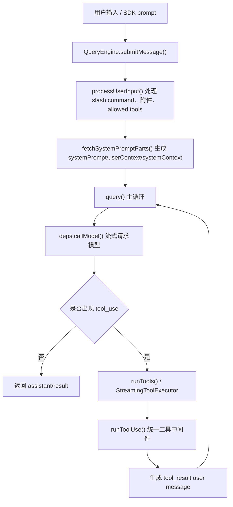
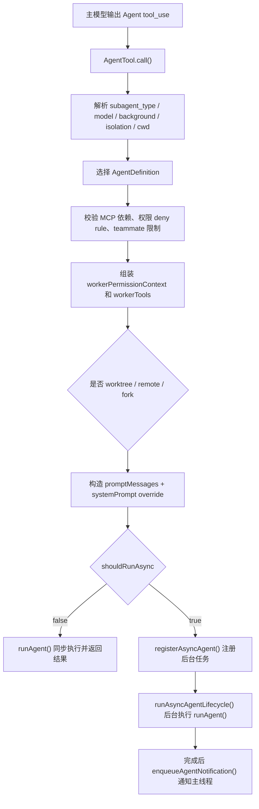
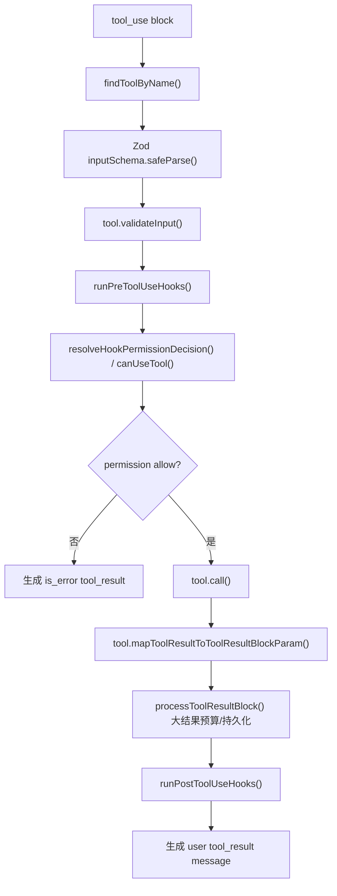
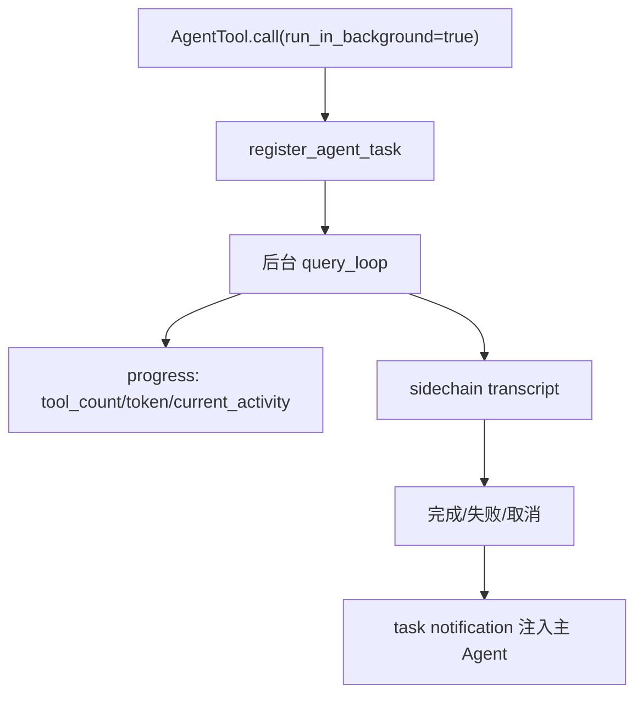

# free-code Agent 能力技术拆解与可复制设计

> 参考仓库：`reference_repos/free-code`
>
> 当前快照：`db7d216 RIK register`
>
> 本文只整理其 agent 能力的工程实现方式，作为本项目后续 Agent 编排、工具治理、后台任务和多 Agent 协作的参考。该仓库来源和定位较特殊，不建议直接复制运行链路或安装脚本；更适合抽取架构模式和局部设计。

## 1. 一句话结论

`free-code` 的 Agent 能力不是一个“Agent 类”，而是一套分层系统：

1. `QueryEngine` 把 CLI/SDK 输入整理成统一会话状态。
2. `query()` 实现 LLM 主循环：发模型请求、接收 `tool_use`、执行工具、把 `tool_result` 回灌给下一轮。
3. `Tool.ts` 定义统一工具协议，所有工具都要经过 schema 校验、权限、hook、执行、结果映射。
4. `AgentTool` 把“启动子 Agent”本身做成一个工具，主模型通过工具调用来委派任务。
5. `runAgent()` 给子 Agent 重新组装系统 prompt、工具池、MCP、权限、消息上下文和 transcript。
6. `LocalAgentTask` 把长任务后台化，负责进度、停止、通知、输出文件和恢复。
7. `AgentDefinition` 用配置描述 agent 类型，支持内置 agent、自定义 markdown agent、插件 agent。

这套设计的核心是：**模型循环只认识 message + tool；Agent 编排也是 tool；所有副作用都收口到统一工具中间件和任务状态机里。**

## 2. 重点源码地图

| 能力 | 主要文件 | 作用 |
|---|---|---|
| SDK/Headless 会话包装 | `src/QueryEngine.ts` | `submitMessage()` 维护多轮消息、系统 prompt、usage、权限拒绝，并把 `query()` 输出转换为 SDK 消息 |
| LLM 主循环 | `src/query.ts` | 每轮调用模型，收集 `tool_use`，执行工具，追加 `tool_result` 后继续下一轮 |
| 工具协议 | `src/Tool.ts` | 定义 `Tool`、`ToolUseContext`、`buildTool()` 默认实现 |
| 工具执行中间件 | `src/services/tools/toolExecution.ts` | Zod 校验、工具自校验、PreToolUse hook、权限决策、调用工具、PostToolUse hook、结果封装 |
| 工具编排 | `src/services/tools/toolOrchestration.ts` | 把工具调用按并发安全性分批，读类工具并发，写类工具串行 |
| 流式工具执行 | `src/services/tools/StreamingToolExecutor.ts` | 工具调用一边 streaming 出来一边启动执行，结果按安全顺序回收 |
| Agent 工具 | `src/tools/AgentTool/AgentTool.tsx` | 主模型调用 `Agent(...)` 启动同步/异步/隔离/远程/teammate agent |
| 子 Agent 运行 | `src/tools/AgentTool/runAgent.ts` | 构造子 Agent 上下文、工具池、MCP、系统 prompt、hooks、transcript，然后调用 `query()` |
| Agent 定义加载 | `src/tools/AgentTool/loadAgentsDir.ts` | 加载内置、自定义 markdown、插件 agent，合并覆盖优先级 |
| Agent 工具过滤与结果 | `src/tools/AgentTool/agentToolUtils.ts` | 工具 allow/deny、异步 agent 生命周期、结果提取、handoff classifier |
| 内置 Agent | `src/tools/AgentTool/built-in/*.ts` | `general-purpose`、`Explore`、`Plan`、`verification` 等内置角色 |
| 后台 Agent 任务 | `src/tasks/LocalAgentTask/LocalAgentTask.tsx` | 注册、进度、完成、失败、kill、后台通知、输出文件 |
| 任务基础类型 | `src/Task.ts` | `TaskType`、`TaskStatus`、任务 ID、任务基础状态 |
| 工具池组装 | `src/tools.ts` / `src/constants/tools.ts` | 内置工具、MCP 工具、权限过滤、子 Agent 禁用工具、异步 Agent 可用工具 |
| fork 子 Agent | `src/tools/AgentTool/forkSubagent.ts` | 让子 Agent 继承父上下文并共享 prompt cache 的实验能力 |

## 3. 总体执行链路

### 3.1 主线程普通对话



关键点：

- `QueryEngine` 是面向 SDK/headless 的会话壳，真正的 agent loop 在 `query.ts`。
- `query()` 不依赖具体工具实现，只依赖 `ToolUseContext.options.tools` 和 `canUseTool`。
- 每个工具执行结果都会被包装成 `user` 消息里的 `tool_result` block，下一轮模型能继续读到。
- `stop_reason === tool_use` 不被当成唯一依据，代码直接检查流式 assistant message 中是否有 `tool_use` block。

### 3.2 子 Agent 启动链路



关键点：

- `AgentTool` 本身是普通工具，主模型通过工具协议启动子 Agent。
- 子 Agent 并不是复用父 Agent 的 `ToolUseContext`，而是通过 `createSubagentContext()` 克隆/隔离必要状态。
- 同步 agent 会阻塞当前 turn，异步 agent 会注册为任务并通过 `<task-notification>` 回到主线程。
- `fork` 是特殊路径：不指定 `subagent_type` 时，子 Agent 继承父上下文和系统 prompt，用于并行研究/实现。

## 4. QueryEngine：把会话服务化

`src/QueryEngine.ts` 里的 `QueryEngine` 是可复制价值很高的一层。它让同一套 agent loop 能被 CLI、SDK、远程控制等入口复用。

### 4.1 QueryEngineConfig

核心配置包括：

- `cwd`：会话工作目录。
- `tools`：本轮可用工具。
- `commands`：slash command 列表。
- `mcpClients`：MCP 连接。
- `agents`：可用 AgentDefinition。
- `canUseTool`：权限决策函数。
- `getAppState` / `setAppState`：全局状态读写。
- `initialMessages`：恢复历史。
- `readFileCache`：文件读取缓存。
- `customSystemPrompt` / `appendSystemPrompt`：系统 prompt 覆盖。
- `maxTurns` / `maxBudgetUsd` / `taskBudget`：控制 loop 上限。
- `jsonSchema`：结构化输出约束。
- `handleElicitation`：MCP URL elicitation 的非交互回调。

### 4.2 submitMessage() 做了什么

`submitMessage(prompt)` 大致分为 7 步：

1. 固定 `cwd`，决定是否持久化 transcript。
2. 解析主模型和 thinking 配置。
3. `fetchSystemPromptParts()` 生成默认系统 prompt、用户上下文、系统上下文。
4. 构造 `ProcessUserInputContext`，处理 slash command、附件、allowed tools。
5. 把用户消息先写 transcript，避免请求中断后无法 resume。
6. yield 一个 `system_init` SDK 消息，告诉调用方当前模型、工具、MCP、agent、permissionMode。
7. 调用 `query()`，把内部 message 映射成 SDK 消息、累计 usage、记录 permission denials，最后 yield `result`。

可复制点：

- **服务层不要直接调模型**：先把会话、权限、工具、系统 prompt、历史消息整理成一个统一 query config。
- **prompt 入队后先落盘**：用户输入一旦接受就写 transcript，哪怕模型请求还没返回，后续也能恢复。
- **权限拒绝单独收集**：`wrappedCanUseTool` 把拒绝事件记录为 SDK 结果的一部分，便于上层 UI/服务审计。

## 5. query()：模型主循环骨架

`src/query.ts` 是核心 agent loop。

### 5.1 状态对象

它把循环中会变化的状态集中在 `State`：

- `messages`
- `toolUseContext`
- `autoCompactTracking`
- `maxOutputTokensRecoveryCount`
- `hasAttemptedReactiveCompact`
- `pendingToolUseSummary`
- `stopHookActive`
- `turnCount`
- `transition`

这种写法比在循环里散落多个变量更适合做恢复、压缩、错误重试。

### 5.2 每轮循环的主要阶段

1. 构建 `queryTracking`，给每次模型请求打 chain/depth。
2. 截取 compact boundary 后的消息。
3. 应用工具结果预算，把大结果替换成文件引用。
4. 按需 snip、microcompact、context collapse、autocompact。
5. 组合最终 system prompt：`appendSystemContext(systemPrompt, systemContext)`。
6. 调用 `deps.callModel()` 流式拿 assistant message。
7. 收集 assistant 中的 `tool_use` blocks。
8. 如果没有工具调用，执行 stop hooks，然后结束。
9. 如果有工具调用，执行工具，得到 `tool_result`。
10. 注入 attachment、memory、skill discovery、task notification。
11. 以 `messages + assistantMessages + toolResults` 进入下一轮。

### 5.3 可复制伪代码

```ts
async function* queryLoop(params) {
  let state = initState(params)

  while (true) {
    const request = buildModelRequest(state)
    const assistantMessages = []
    const toolUseBlocks = []

    for await (const msg of callModel(request)) {
      yield msg
      if (msg.type === "assistant") {
        assistantMessages.push(msg)
        toolUseBlocks.push(...extractToolUses(msg))
      }
    }

    if (toolUseBlocks.length === 0) {
      const stopResult = await runStopHooks(...)
      if (stopResult.shouldContinue) {
        state = appendMessages(state, assistantMessages, stopResult.messages)
        continue
      }
      return { reason: "completed" }
    }

    const toolResults = []
    for await (const update of runTools(toolUseBlocks, assistantMessages, context)) {
      if (update.message) {
        yield update.message
        toolResults.push(update.message)
      }
      if (update.newContext) {
        state.toolUseContext = update.newContext
      }
    }

    state = {
      ...state,
      messages: [...request.messages, ...assistantMessages, ...toolResults],
      turnCount: state.turnCount + 1,
    }
  }
}
```

## 6. Tool 协议：统一所有副作用

`src/Tool.ts` 的 `Tool` 类型非常重，核心原因是 CLI agent 的所有能力都通过工具暴露。一个工具至少要描述：

- `name` / `aliases` / `searchHint`
- `inputSchema` / `inputJSONSchema`
- `call()`
- `description()`
- `prompt()`
- `isConcurrencySafe()`
- `isReadOnly()`
- `isDestructive()`
- `validateInput()`
- `checkPermissions()`
- `mapToolResultToToolResultBlockParam()`
- `renderToolUseMessage()` / `renderToolResultMessage()`
- `getActivityDescription()`
- `toAutoClassifierInput()`

### 6.1 buildTool() 的价值

`buildTool()` 给工具填默认实现：

- `isEnabled` 默认 true。
- `isConcurrencySafe` 默认 false。
- `isReadOnly` 默认 false。
- `isDestructive` 默认 false。
- `checkPermissions` 默认 allow。
- `toAutoClassifierInput` 默认空字符串。
- `userFacingName` 默认工具名。

可复制点：

- 工具默认值应当**保守**：并发安全默认 false，读写默认不假设只读。
- 工具实现不应该自己到处处理权限、hook、UI、telemetry；这些放在统一执行中间件。

### 6.2 ToolUseContext

`ToolUseContext` 是工具运行时的全部上下文，关键字段包括：

- `options.tools`：当前可用工具。
- `options.mainLoopModel`：当前模型。
- `options.mcpClients` / `mcpResources`：MCP 环境。
- `options.agentDefinitions`：可用子 Agent。
- `abortController`：取消控制。
- `readFileState`：文件读取状态缓存。
- `getAppState` / `setAppState`：状态读写。
- `setAppStateForTasks`：给异步子 Agent 注册后台任务用的根状态写入口。
- `setInProgressToolUseIDs`：UI/状态展示当前工具。
- `agentId` / `agentType`：子 Agent 标识。
- `messages`：当前 conversation messages。
- `queryTracking`：链路追踪。
- `contentReplacementState`：大工具结果替换状态。

可复制点：

- 把工具所需运行态集中成 context，不让工具直接依赖全局变量。
- 子 Agent 创建 context 时，明确哪些字段克隆、哪些共享、哪些置空。

## 7. 工具执行中间件

`src/services/tools/toolExecution.ts` 的 `runToolUse()` / `checkPermissionsAndCallTool()` 是工具执行流水线。

### 7.1 执行顺序



### 7.2 并发策略

`src/services/tools/toolOrchestration.ts` 先用 `tool.isConcurrencySafe(input)` 给工具调用分批：

- 连续的并发安全工具可以一起跑。
- 非并发安全工具单独串行跑。
- 并发批次里的 context modifier 先排队，批次结束后按原 tool order 应用。

`StreamingToolExecutor` 进一步优化为：

- 模型流式输出工具时就尝试启动工具。
- 并发安全工具可同时执行。
- 非并发工具独占执行。
- progress message 可以提前 yield。
- 如果 Bash 工具出错，会取消 sibling Bash/相关工具，避免无意义继续。

可复制点：

- 工具并发不要只看“是不是只读”，要由工具自己声明 `isConcurrencySafe(input)`。
- 写操作、编辑操作、依赖上下文的操作默认串行。
- 进度事件和最终结果分离，前者用于 UI/SDK，后者用于模型下一轮。

## 8. AgentDefinition：用配置定义角色

`src/tools/AgentTool/loadAgentsDir.ts` 把所有 agent 统一成 `AgentDefinition`。

### 8.1 字段设计

`BaseAgentDefinition` 关键字段：

- `agentType`：agent 类型名，例如 `general-purpose`、`Explore`。
- `whenToUse`：给主模型看的使用说明。
- `tools`：允许工具列表，支持 `*`。
- `disallowedTools`：禁止工具列表。
- `skills`：启动时预加载的 skill。
- `mcpServers`：agent 专属 MCP servers。
- `hooks`：agent 生命周期内注册的 hooks。
- `color`：UI 展示色。
- `model`：模型覆盖，支持 `inherit`。
- `effort`：thinking/effort 覆盖。
- `permissionMode`：权限模式覆盖。
- `maxTurns`：最多 agentic turns。
- `initialPrompt`：首轮前置 prompt。
- `memory`：agent 记忆作用域。
- `background`：强制后台执行。
- `isolation`：`worktree` 或内部 ant-only `remote`。
- `omitClaudeMd`：只读 agent 可省略 CLAUDE.md 以节省 token。

### 8.2 加载与覆盖顺序

`getAgentDefinitionsWithOverrides(cwd)` 会加载：

1. built-in agents
2. plugin agents
3. user/project/policy/flag settings agents

然后 `getActiveAgentsFromList()` 按组覆盖同名 agent。其优先级逻辑是后面的组覆盖前面的组：

```ts
const agentGroups = [
  builtInAgents,
  pluginAgents,
  userAgents,
  projectAgents,
  flagAgents,
  managedAgents,
]
```

可复制点：

- 内置 agent 提供默认能力。
- 项目级 agent 覆盖内置 agent。
- 管理策略 agent 最高优先级。
- 解析失败不让系统崩，返回 built-in agents 并记录 failedFiles。

### 8.3 Markdown Agent 格式

该仓库从 `agents/*.md` 解析自定义 agent。可复制为：

```md
---
name: qualification-reviewer
description: 审查投标资格条件、企业资质、业绩与人员要求
tools:
  - Read
  - Grep
  - Glob
  - Bash(git diff:*)
disallowedTools:
  - Write
  - Edit
model: inherit
permissionMode: default
maxTurns: 12
background: false
memory: project
---

你是投标资格审查 agent。你的任务是...
```

注意：`free-code` 实现里 frontmatter 支持 `tools`、`disallowedTools`、`skills`、`mcpServers`、`hooks`、`model`、`effort`、`permissionMode`、`maxTurns`、`background`、`memory`、`isolation` 等字段。

## 9. AgentTool：把委派做成一个工具

`src/tools/AgentTool/AgentTool.tsx` 是 agent 能力最核心的文件。

### 9.1 输入 schema

基础输入：

```ts
{
  description: string
  prompt: string
  subagent_type?: string
  model?: "sonnet" | "opus" | "haiku"
  run_in_background?: boolean
}
```

扩展输入：

```ts
{
  name?: string
  team_name?: string
  mode?: PermissionMode
  isolation?: "worktree" | "remote"
  cwd?: string
}
```

实际暴露哪些字段受 feature flag 控制。例如 fork 开启时会隐藏 `run_in_background`，因为所有 agent 统一异步。

### 9.2 prompt 给主模型的指导

`src/tools/AgentTool/prompt.ts` 为 Agent 工具生成说明：

- 告诉模型可用 agent 类型和工具范围。
- 说明何时应该用 Agent，何时不该用。
- 要求 `description` 简短。
- 强调子 Agent 返回结果对用户不可见，主 Agent 要自己转述。
- fork 模式下，强调不要偷看输出文件，不要伪造 fork 结果。

可复制点：

- “什么时候用/不用 Agent”的提示很重要，否则主模型会把简单读文件也外包。
- 子 Agent prompt 要像给聪明同事 brief：背景、目标、已经尝试过的、边界、输出要求。

### 9.3 call() 的关键分支

`AgentTool.call()` 主要做这些事：

1. 从 appState 拿 permissionMode 和 agentDefinitions。
2. 判断 teammate/team_name/name，必要时走 `spawnTeammate()`。
3. 解析 `effectiveType`：
   - 显式 `subagent_type`：用指定 agent。
   - fork 开启且未指定：走 fork。
   - fork 未开启且未指定：默认 `general-purpose`。
4. 过滤被权限规则 deny 的 agent。
5. 等待并校验 required MCP servers。
6. 计算模型：`getAgentModel(agent.model, parentModel, modelParam, permissionMode)`。
7. 判断是否异步：`run_in_background`、agent.definition.background、coordinator、fork、assistant/proactive 等。
8. 用 agent 自己的 permission mode 组装 worker tools。
9. 如需 worktree，创建临时 git worktree。
10. 构造 `runAgentParams`。
11. 异步则 `registerAsyncAgent()` + `runAsyncAgentLifecycle()`。
12. 同步则直接 `runAgent()`，收集消息并 `finalizeAgentTool()`。

### 9.4 同步 vs 异步

同步 agent：

- 当前 turn 等待子 Agent 完成。
- 适合短任务、需要立即汇总结果的任务。
- 可注册 foreground task，运行超过阈值时允许 background。

异步 agent：

- 立即返回：

```ts
{
  status: "async_launched",
  agentId,
  description,
  prompt,
  outputFile,
  canReadOutputFile
}
```

- 后台跑完后发送 `<task-notification>` 给主线程。
- 适合长耗时任务、并行研究、多模块实现。

可复制点：

- 不要把“后台执行”做成外部线程直接乱改状态；先注册 task，再让生命周期函数驱动状态变化。
- 子 Agent 完成后以消息形式通知主 Agent，而不是直接把结果塞进当前模型上下文。

## 10. runAgent：真正创建子 Agent 运行环境

`src/tools/AgentTool/runAgent.ts` 是子 Agent 的实际启动器。

### 10.1 关键步骤

1. 创建 `agentId`。
2. 根据 `forkContextMessages` 决定是否带入父上下文。
3. 创建子 agent 的 `readFileState`：
   - fork：clone 父文件缓存。
   - 普通 subagent：创建新缓存。
4. 获取 `userContext` / `systemContext`。
5. 对 Explore/Plan 这类只读 agent 省略部分上下文，减少 token。
6. 构造 `agentGetAppState()`，覆盖权限模式、effort、allowedTools。
7. `resolveAgentTools()` 得到该 agent 可用工具。
8. 构造 agent system prompt。
9. 决定 abort controller：
   - async：独立 AbortController。
   - sync：共享父 controller。
10. 执行 `SubagentStart` hooks，附加上下文。
11. 注册 agent frontmatter hooks。
12. 预加载 agent frontmatter 中声明的 skills。
13. 初始化 agent 专属 MCP servers。
14. `createSubagentContext()` 创建隔离上下文。
15. 记录 sidechain transcript 和 agent metadata。
16. 调用 `query()`。
17. finally 清理 MCP、hooks、prompt cache tracking、readFileState、background bash tasks。

### 10.2 子 Agent 工具池

普通子 Agent 的工具池不是父工具池的简单拷贝：

```ts
const workerPermissionContext = {
  ...appState.toolPermissionContext,
  mode: selectedAgent.permissionMode ?? "acceptEdits",
}
const workerTools = assembleToolPool(workerPermissionContext, appState.mcp.tools)
const resolvedTools = resolveAgentTools(agentDefinition, workerTools, isAsync)
```

然后再叠加 agent frontmatter 的 MCP tools。

可复制点：

- 子 Agent 应该有自己的权限模式和工具白名单/黑名单。
- 父 Agent 当前被限制的工具，不一定等同于子 Agent 的工具集。
- 但是 SDK `--allowedTools` 这类调用方显式授权要保留。

### 10.3 createSubagentContext 隔离策略

`src/utils/forkedAgent.ts` 的 `createSubagentContext()` 是很值得复用的设计：

| 字段 | 默认策略 |
|---|---|
| `readFileState` | clone，避免子 Agent 干扰父缓存 |
| `abortController` | 子 controller 链到父 controller |
| `getAppState` | 包装后设置 `shouldAvoidPermissionPrompts` |
| `setAppState` | 默认 no-op，避免子 Agent 乱改父 UI |
| `setAppStateForTasks` | 保留根写入口，保证后台任务能注册/kill |
| `localDenialTracking` | 子 Agent 独立维护权限拒绝计数 |
| `setResponseLength` | 可选择共享，用于统计 |
| `messages` | 可覆盖为子 Agent 初始消息 |
| `agentId` / `agentType` | 子 Agent 独立标识 |
| `queryTracking` | 新 chain，depth + 1 |

这是一个很好的模式：**默认隔离，按需共享。**

## 11. 后台任务：LocalAgentTask

`src/tasks/LocalAgentTask/LocalAgentTask.tsx` 把异步 agent 纳入统一 Task 框架。

### 11.1 任务状态

`LocalAgentTaskState` 继承 `TaskStateBase`，额外包含：

- `agentId`
- `prompt`
- `selectedAgent`
- `agentType`
- `model`
- `abortController`
- `error`
- `result`
- `progress`
- `messages`
- `isBackgrounded`
- `pendingMessages`
- `retain`
- `diskLoaded`
- `evictAfter`

### 11.2 进度追踪

`ProgressTracker` 记录：

- `toolUseCount`
- `latestInputTokens`
- `cumulativeOutputTokens`
- `recentActivities`

每次收到 assistant message，如果里面有 `tool_use`，就提取工具名和输入，用工具的 `getActivityDescription()` 生成“正在做什么”的 UI 文案。

### 11.3 完成通知

`enqueueAgentNotification()` 生成 XML-ish 消息：

```xml
<task-notification>
  <task_id>...</task_id>
  <output_file>...</output_file>
  <status>completed</status>
  <summary>Agent "..." completed</summary>
  <result>...</result>
  <usage>
    <total_tokens>...</total_tokens>
    <tool_uses>...</tool_uses>
    <duration_ms>...</duration_ms>
  </usage>
</task-notification>
```

这条消息进入 message queue，后续由主 `query()` loop 作为 attachment 注入给主模型。

可复制点：

- 后台任务结果以“消息”返回给主 Agent，保持 agent loop 的统一输入模型。
- 输出文件路径和任务 ID 放在通知里，主 Agent 可以按需读取，不强制把完整 transcript 塞回上下文。
- 完成状态先落 task，再做 classifier、worktree cleanup 等慢操作，避免 UI/等待方被挂住。

## 12. Fork 子 Agent：继承上下文但共享缓存

`src/tools/AgentTool/forkSubagent.ts` 是一个高级能力。

### 12.1 目的

fork 子 Agent 适合：

- 开放式研究问题。
- 并行查多个方向。
- 把中间工具噪声留在子 Agent，不污染主上下文。
- 利用父 prompt cache，减少重复上下文成本。

### 12.2 实现要点

- fork path 不指定 `subagent_type`。
- 子 Agent 使用 `FORK_AGENT`，`model: "inherit"`，`permissionMode: "bubble"`。
- 子 Agent 继承父 `systemPrompt` 的已渲染字节，避免重新计算导致 cache miss。
- `buildForkedMessages()` 保留父 assistant message 里的所有 `tool_use` blocks。
- 为每个 tool_use 填充相同 placeholder tool_result。
- 最后追加每个 fork 独有的 directive。

这样多个 fork 的 API request prefix 最大程度一致，利于 prompt cache。

### 12.3 递归保护

fork child 仍保留 Agent tool，以保持工具定义相同，但运行时禁止再次 fork：

- 检查 `querySource === agent:builtin:fork`。
- 或扫描消息中是否有 `<fork_boilerplate>` 标签。

可复制点：

- 如果我们未来做“并行标书条款审查”，可以借鉴 fork：子任务继承父上下文，但最终只回传摘要，不把大量检索噪声带回主 Agent。
- 需要严禁 fork 递归和结果幻觉：主 Agent 未收到 notification 前不能假装知道结果。

## 13. 权限和安全边界

虽然 `free-code` README 宣称移除了部分 prompt guardrails，但代码层仍有大量工程权限控制。这些设计值得借鉴。

### 13.1 工具层权限

每个工具执行前都经过：

- `inputSchema.safeParse()`
- `tool.validateInput()`
- `runPreToolUseHooks()`
- `resolveHookPermissionDecision()`
- `canUseTool()`
- `tool.checkPermissions()`

权限结果不是 boolean，而是 `PermissionResult`：

- `allow`
- `deny`
- `ask`
- `updatedInput`
- `message`
- `decisionReason`
- `contentBlocks`
- `acceptFeedback`

### 13.2 子 Agent 工具限制

`src/constants/tools.ts` 定义：

- `ALL_AGENT_DISALLOWED_TOOLS`
- `CUSTOM_AGENT_DISALLOWED_TOOLS`
- `ASYNC_AGENT_ALLOWED_TOOLS`
- `IN_PROCESS_TEAMMATE_ALLOWED_TOOLS`
- `COORDINATOR_MODE_ALLOWED_TOOLS`

例如异步 Agent 默认允许 Read、Search、Todo、Shell、Edit/Write、Skill、ToolSearch、Worktree 等，但禁止需要主线程状态的任务工具、递归 Agent、ExitPlanMode 等。

### 13.3 自动权限模式

在 auto mode 下，还有 transcript classifier / handoff classifier：

- 工具执行前判断是否允许。
- 子 Agent 完成 handoff 时可再次审查它做过的动作。
- 如果 classifier 不可用或阻断，会把 warning 注入主 Agent。

可复制点：

- 对“投标文件生成”来说，至少要区分只读工具、草稿生成工具、真实写入/导出工具、外部联网工具。
- 子 Agent 默认应最小权限，只有特定角色才允许写文件或导出。
- 后台 Agent 无法弹 UI 权限框时，应自动 deny 或 bubble 到父线程，而不是静默执行。

## 14. MCP 与插件扩展

MCP 在 free-code 中有两层：

1. 全局 MCP tools 进入 `appState.mcp.tools`，再由 `assembleToolPool()` 合并。
2. AgentDefinition 可以声明 `mcpServers`，`runAgent()` 启动时临时连接 agent 专属 MCP。

关键设计：

- agent 可声明 `requiredMcpServers`，`AgentTool.call()` 在启动前确认 server 有工具可用。
- agent frontmatter 可以引用已有 MCP server 名，也可以内联 MCP config。
- 新建的 inline MCP client 在 agent 结束时 cleanup；共享 client 不清理。
- MCP tools 和内置 tools 去重时，内置工具优先。

可复制点：

- 投标 Agent 可以把外部服务做成 MCP/工具：企业库、资质证书库、招标平台查询、OCR/RAG 检索等。
- 不同 agent 只加载自己需要的 MCP，减少 prompt 工具列表膨胀。

## 15. 内置 Agent 的写法

### 15.1 general-purpose

`src/tools/AgentTool/built-in/generalPurposeAgent.ts`：

- `agentType: "general-purpose"`
- `tools: ["*"]`
- 系统 prompt 强调搜索、分析、多步研究、不要主动创建文档。
- 不指定模型，使用默认子 Agent 模型。

适合兜底复杂任务。

### 15.2 Explore

`src/tools/AgentTool/built-in/exploreAgent.ts`：

- 只做代码搜索和分析。
- 明确 READ-ONLY，不允许创建、修改、删除、移动文件。
- `disallowedTools` 禁止 Agent、ExitPlanMode、Edit、Write、NotebookEdit。
- 外部用户默认 haiku，内部可 inherit。
- `omitClaudeMd: true` 减少上下文成本。

可复制点：

- 我们可以做 `TenderExploreAgent`：只读招标文件/企业资料/RAG 结果，不允许写投标文件。
- 用强约束 prompt + 工具 deny list 双层保证只读。

### 15.3 Plan

Plan agent 与 Explore 类似，偏规划分析。适合复杂任务前先拆步骤，不直接执行。

可复制点：

- 做 `BidPlanAgent`：根据招标文件生成工作分解、风险点、资料缺口，不写最终文档。

## 16. 对本项目的可复制落地方案

结合我们当前“投标 Agent”项目，建议复制的是架构，不是源码。

### 16.1 第一阶段：统一 Tool 协议

先给后端现有能力套一个统一工具接口：

```python
class AgentTool(Protocol):
    name: str
    description: str
    input_schema: dict
    max_result_size_chars: int

    async def validate_input(self, input, ctx) -> ValidationResult: ...
    async def check_permissions(self, input, ctx) -> PermissionResult: ...
    async def call(self, input, ctx, on_progress=None) -> ToolResult: ...
    def is_concurrency_safe(self, input) -> bool: ...
    def is_read_only(self, input) -> bool: ...
    def map_result_to_message(self, result, tool_use_id) -> Message: ...
```

候选工具：

- `TenderReadTool`：读取招标文件章节。
- `EvidenceSearchTool`：检索企业资料/证据。
- `QualificationEvaluateTool`：资格条件核验。
- `ComplianceCheckTool`：响应性条款检查。
- `DraftSectionTool`：生成章节草稿。
- `ExportDocxTool`：导出投标文件。
- `AskUserTool`：向用户追问缺失材料。

### 16.2 第二阶段：AgentDefinition 配置化

定义 agent 配置：

```yaml
agent_type: qualification-reviewer
when_to_use: 审查资格条件、企业资质、业绩、人员和证明材料
tools:
  - TenderRead
  - EvidenceSearch
  - QualificationEvaluate
  - AskUser
disallowed_tools:
  - ExportDocx
  - DraftSection
model: inherit
permission_mode: default
max_turns: 8
background: false
```

建议内置 agent：

| Agent | 用途 | 默认工具 |
|---|---|---|
| `tender-explorer` | 只读分析招标文件、提取关键条款 | Read/Search |
| `qualification-reviewer` | 资格条件与企业资料核验 | Read/Search/Evaluate |
| `compliance-reviewer` | 响应性、废标项、格式要求检查 | Read/Search/Check |
| `draft-writer` | 按模板生成章节草稿 | Read/Search/Draft |
| `pricing-assistant` | 报价表和商务条款检查 | Read/Search/Pricing |
| `evidence-binder` | 证据绑定、页码、出处说明 | Read/Search/Bind |
| `export-verifier` | 导出前校验目录、格式、缺项 | Read/Check |

### 16.3 第三阶段：实现 AgentTool

把“委派子 Agent”也实现成工具：

```json
{
  "description": "资格审查",
  "prompt": "请审查本项目资格条件是否满足...",
  "subagent_type": "qualification-reviewer",
  "run_in_background": false
}
```

调用流程：

1. 查找 `AgentDefinition`。
2. 根据定义组装工具池。
3. 创建子 Agent context。
4. 调用同一个 `query_loop()`。
5. 返回子 Agent 最后一条 assistant text + usage + tool count。

### 16.4 第四阶段：后台任务化

对长任务，例如“整份标书一致性审查”“生成完整初稿”“全证据页码核验”，使用后台 task：



任务状态建议：

```python
class AgentTaskState(BaseModel):
    id: str
    type: Literal["local_agent"]
    status: Literal["pending", "running", "completed", "failed", "killed"]
    agent_type: str
    description: str
    prompt: str
    output_file: str | None
    result: AgentResult | None
    progress: AgentProgress | None
    error: str | None
    started_at: datetime
    ended_at: datetime | None
```

### 16.5 第五阶段：权限和审计

投标场景建议最小实现：

- Read/Search/Evaluate 默认 allow。
- DraftSection 默认 allow，但只写草稿区，不覆盖正式稿。
- ExportDocx 需要用户确认或任务状态满足“校验通过”。
- 外部联网查询需要显式确认。
- 删除、覆盖、批量替换默认 deny。
- 所有工具调用记录到 audit/task transcript。

## 17. 建议复制的设计模式清单

1. **统一 query loop**：所有 agent、子 agent、SDK 入口都跑同一套 loop。
2. **工具即能力边界**：所有副作用都必须经过 Tool 协议。
3. **AgentTool 即委派入口**：主模型不直接调用子 Agent API，而是调用工具。
4. **AgentDefinition 配置化**：角色、工具、模型、权限、MCP、hooks 都配置化。
5. **默认隔离，按需共享**：子 Agent context 不共享父状态，除非显式需要。
6. **后台任务状态机**：异步 Agent 先注册 task，再运行，再通知。
7. **sidechain transcript**：子 Agent 历史独立保存，主上下文只拿摘要/通知。
8. **工具结果预算**：大结果不要直接塞回模型，上限后持久化并给预览。
9. **并发安全由工具声明**：读类可并发，写类默认串行。
10. **MCP/插件按 agent 加载**：减少工具列表和上下文成本。
11. **只读 Agent 双保险**：prompt 约束 + disallowedTools。
12. **handoff 前审查**：子 Agent 完成后可由 classifier/rule 做交接审计。

## 18. 不建议直接照搬的部分

1. **feature flag 复杂度**：`free-code` 继承了大量 `bun:bundle` feature gates，对我们当前阶段太重。
2. **React/Ink UI 层**：它的 UI 渲染、progress panel、terminal 交互不适合后端优先的投标系统直接搬。
3. **复杂 telemetry/OTel**：我们可以保留 audit event，但不需要复制完整 tracing。
4. **fork prompt cache 细节**：很高级，但第一版可先不做，避免上下文一致性和恢复复杂度。
5. **teammate/swarm/tmux**：当前投标 Agent 先做后台 task 即可，多进程协作以后再考虑。
6. **安全 guardrail 移除相关改动**：不应作为本项目参考。

## 19. 最小可复制骨架

如果我们只复制最小闭环，可以按这个结构做：

```text
agent/
  definitions.py        # AgentDefinition 加载、覆盖、校验
  tools/
    base.py             # Tool 协议、ToolUseContext、ToolResult
    registry.py         # 工具注册与过滤
    execution.py        # 校验、权限、调用、结果映射
  query_loop.py         # LLM loop
  agent_tool.py         # 启动子 Agent 的工具
  run_agent.py          # 构造子 Agent 上下文并跑 query_loop
  tasks.py              # 后台 AgentTask 状态机
  transcript.py         # 主会话和 sidechain transcript
  permissions.py        # allow/deny/ask/rules
```

最小 loop：

```python
async def query_loop(messages, system_prompt, tools, ctx, max_turns=20):
    for turn in range(max_turns):
        assistant = await llm_call(messages, system_prompt, tools)
        yield assistant

        tool_uses = extract_tool_uses(assistant)
        if not tool_uses:
            return QueryResult(reason="completed")

        tool_results = []
        async for update in run_tools(tool_uses, assistant, ctx):
            yield update.message
            tool_results.append(update.message)
            if update.new_context:
                ctx = update.new_context

        messages = [*messages, assistant, *tool_results]

    return QueryResult(reason="max_turns")
```

最小 AgentTool：

```python
async def call_agent_tool(input, parent_ctx):
    agent_def = registry.get_agent(input.subagent_type or "general-purpose")
    worker_tools = resolve_agent_tools(agent_def, parent_ctx.available_tools)
    child_ctx = create_subagent_context(parent_ctx, tools=worker_tools)
    child_messages = [user_message(input.prompt)]

    if input.run_in_background or agent_def.background:
        task = register_agent_task(agent_def, input, child_ctx)
        start_background(run_agent(task, agent_def, child_messages, child_ctx))
        return {"status": "async_launched", "task_id": task.id}

    messages = []
    async for msg in run_agent(agent_def, child_messages, child_ctx):
        messages.append(msg)
    return finalize_agent_result(messages)
```

## 20. 对当前项目的下一步建议

建议不要一口气实现完整 free-code 版本，而是按风险递进：

1. 先整理本项目现有服务能力，抽象成 5-8 个 Tool。
2. 给每个 Tool 标注 `read_only`、`concurrency_safe`、`destructive`。
3. 引入 `AgentDefinition`，先做 3 个只读/半只读 agent：`tender-explorer`、`qualification-reviewer`、`compliance-reviewer`。
4. 实现同步 `AgentTool`，让主 Agent 能委派审查。
5. 再把长耗时审查后台化，增加 `AgentTaskState`、progress、notification。
6. 最后考虑 worktree/fork/MCP 专属加载等高级能力。

这样能把 `free-code` 最有价值的设计搬过来，同时避免过早引入 CLI 端复杂度。
