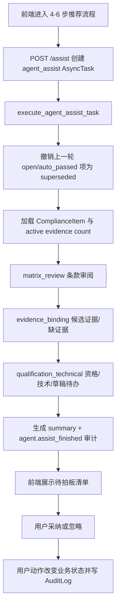

# 投标 Agent 能力代码分析

> 更新时间：2026-06-19
> 分析对象：当前仓库中与 Agent / AI 辅助执行相关的后端、前端、数据模型、迁移和测试代码。
> 结论口径：当前实现不是“多 Agent 自主协作框架”，而是“受控工作流 + AI 服务能力 + 异步任务 + 统一待拍板清单”的半自主投标助手。

## 1. 总体结论

当前项目的 Agent 能力已经形成了三层结构：

1. **AI 原子能力层**：通过 `backend/app/prompts/registry.py`、`backend/app/services/compliance_generation.py`、`backend/app/services/context_pack.py` 等服务完成读标、章节规划、合规项抽取、覆盖复核、风险初判和商务/资格草稿生成。
2. **自动化修复层**：`matrix_auto_resolve` 能根据质量门禁阻断原因选择“定向重抽”或“重排章节 + 全量重抽”，并保护人工确认/编辑过的条目。
3. **半自主推进层**：`agent_assist` 串联条款审阅、候选证据、资格/技术待办和草稿 block 审阅，统一输出 `AgentReviewItem`，由用户逐项采纳或忽略。

这套设计的核心边界很清楚：

- Agent 可以自动核验低风险项、提出证据建议、生成参标资格建议、识别技术/草稿待审项。
- Agent 不直接替用户完成最终确认、证据生效、Go/No-Go 决策、技术承诺或正式标书通过。
- 自动执行结果通过 `AuditLog(actor_type="agent")` 留痕；真正改变业务状态的采纳动作仍记为 `actor_type="user"`。

## 2. 能力地图

| 能力 | 关键代码 | 输入 | 输出 | 边界 |
| --- | --- | --- | --- | --- |
| 招标文件读标与合规矩阵抽取 | `backend/app/services/compliance_generation.py`、`backend/app/prompts/registry.py` | 文档版本、解析 chunk、语义章节 | `ComplianceItem`、质量报告 | 只抽取有来源的条款；模型/JSON/schema/来源校验失败会阻断 |
| 矩阵质量门禁自动修复 | `execute_matrix_auto_resolve_task` | 被阻断的质量报告 | 定向重抽或全量重抽后的权威质量报告 | 最多有限轮次；人工确认/编辑过的条目受保护 |
| 企业资料 RAG 候选证据 | `backend/app/services/material_retrieval.py`、`agent_assist._add_evidence_review_items` | 合规项 query、企业资料索引 | 候选资料、片段、置信分、建议理由 | 只查 confirmed 且 public/internal 的资料；建议不等于绑定 |
| 资格预评估 | `backend/app/services/qualification_evaluation.py` | 资格类合规项、企业资料、证据绑定、规则包 | `QualificationEvaluation`、资格状态 | 资格结果变化会撤销旧人工确认；Go/No-Go 必须人工确认 |
| ContextPack 与商务/资格草稿 | `backend/app/services/context_pack.py`、`backend/app/services/business_draft.py` | 已确认矩阵、证据、资格结论、上下文包 | `BusinessDraftChapter`、`DraftBlock`、覆盖报告 | 未确认资格建议、No-Go、ContextPack block 会阻断正式草稿 |
| 半自主 Agent 推进 | `backend/app/services/agent_assist.py` | 当前项目/标段的矩阵项、证据、资格项、草稿 block | `AgentReviewItem` 清单、任务 summary | 只生成待拍板项或自动核验记录；生效动作必须用户采纳 |
| 前端 Agent 工作台 | `frontend/src/pages/app/WorkspacePage.tsx`、`frontend/src/api/bid.ts` | API 返回的任务、summary、review items | Agent 推进面板、待拍板计数、采纳/忽略按钮 | 当前界面自动触发推进；面板展示前 5 条 open 项 |

## 3. 当前 Agent 推进主链路

核心入口是：

- `POST /projects/{project_id}/sections/{section_id}/assist`
- 后端函数：`create_agent_assist_task`
- 异步执行：`execute_agent_assist_task`
- Celery 任务：`tasks.agent_assist`

### 3.1 `AgentReviewItem` 数据模型

`backend/app/models/agent.py` 新增 `AgentReviewItem`，它是当前半自主能力的中心表。

关键字段：

- 范围：`tenant_id`、`project_id`、`section_id`、`async_task_id`、`run_key`。
- 分类：`step`、`action`、`severity`、`requires_human`。
- 状态：`open`、`accepted`、`dismissed`、`superseded`、`auto_passed`。
- 业务对象：`compliance_item_id`、`enterprise_material_id`、`qualification_evaluation_id`、`qualification_decision_id`、`draft_block_id`。
- 解释材料：`confidence_score`、`escalation_reasons`、`recommendation_json`、`source_ref_json`。
- 决策记录：`triggered_by`、`decided_by`、`decided_at`、`decision_reason`。

允许的 `step` 只有三类：

- `matrix_review`：条款审阅。
- `evidence_binding`：企业资料证据建议或缺证据提示。
- `qualification_technical`：资格、Go/No-Go、技术响应、草稿 block 待审。

### 3.2 条款审阅能力

`_add_matrix_review_items` 会遍历当前标段全部未删除合规项，按规则计算：

- `confidence_score`：来源、状态、风险、强制项、资格/截止/技术类型、证据数量共同影响。
- `escalation_reasons`：高风险、强制项、资格项、截止时间、缺来源、缺证据、技术/评分项等都会触发人工确认。
- `severity`：高风险强制资格项可升为 `critical`。

如果存在升级原因，生成 `open` 待拍板项，要求用户确认条款。

如果没有升级原因且置信度大于等于 `0.8800`，生成 `auto_passed` 自动核验记录。这里的自动核验只写 Agent 清单，不修改 `ComplianceItem.status`。

### 3.3 候选证据能力

`_add_evidence_review_items` 只处理“需要企业资料证据但当前没有 active binding”的合规项。

处理方式：

1. 用 `compliance_item_candidate_query` 组合条款、建议、项目区域/行业、标段名称等文本。
2. 调用 `search_material_hits` 检索企业资料。
3. 只允许 `verification_status=confirmed`，且资料级别限定为 `public/internal`。
4. 每个合规项最多返回 2 个候选。
5. 有候选时生成 `accept_evidence_binding` 待拍板项；无候选时生成 `missing_evidence` 待办。

候选证据采纳后才会真正写入 `ComplianceEvidenceBinding`。采纳逻辑还会阻止过期/冲突资料、受限/机密资料和重复等价资料绑定。

### 3.4 资格/技术/草稿能力

`_add_qualification_technical_review_items` 覆盖三类对象：

- 资格项：调用 `run_qualification_evaluation`，生成或更新 `QualificationEvaluation`。
- Go/No-Go：通过 `_build_qualification_decision` 生成 `QualificationDecision` 草稿，推荐值为 `go`、`conditional_go` 或 `no_go`。
- 技术/评分项和草稿 block：技术/评分项必须人工确认；`DraftBlock.review_status` 为 `pending`、`needs_evidence`、`needs_fact`、`needs_confirm` 时进入待审。

代码特别保护已人工确认的资格结果：

- 已确认的 `QualificationDecision` 不会在新一轮 Agent 推进中被覆盖，只生成 `qualification_decision_preserved` 的 `auto_passed` 记录。
- 已确认且结果未变化的 `QualificationEvaluation` 同样保留。
- 如果资格评估结果因条款或证据变化而变化，`qualification_evaluation.py` 会清空旧确认信息。

## 4. 采纳/忽略的业务语义

`accept_agent_review_item` 根据 `action` 分派到不同业务动作：

| action | 采纳后的真实业务动作 |
| --- | --- |
| `confirm_matrix_item` | 确认合规矩阵项为 `confirmed` |
| `review_technical_response` | 确认技术/评分响应项 |
| `accept_evidence_binding` | 创建 active `ComplianceEvidenceBinding` |
| `review_qualification_evaluation` | 标记资格评估项已人工确认 |
| `confirm_qualification_decision` | 确认 Go/No-Go 参标建议 |
| `review_draft_block` | 将草稿 block 标记为 `approved` |
| `missing_evidence` | 确认已知晓缺证据风险，不自动补资料 |
| `ack_llm_technical_advice` | 仅关闭只读技术建议并写审计，不确认技术响应 |
| `ack_llm_draft_advice` | 仅关闭只读草稿建议并写审计，不批准草稿 block |

高风险、强制项或资格项在确认前必须传入 `source_verified=true`，否则返回 409。这一点前端也做了二次确认弹窗。

`dismiss_agent_review_item` 不改变业务对象，只把待拍板项置为 `dismissed` 并写用户审计。

## 5. API 与前端入口

后端 API 位于 `backend/app/api/v1/routes/projects.py`：

- `POST /assist`：创建或复用当前标段的 `agent_assist` 任务。
- `GET /agent-review-items/summary`：获取最新或指定 `run_key` 的汇总。
- `GET /agent-review-items`：按 `status`、`step`、`run_key` 查询待拍板项。
- `POST /agent-review-items/{id}/accept`：采纳 Agent 建议。
- `POST /agent-review-items/{id}/dismiss`：忽略 Agent 建议。

前端封装位于 `frontend/src/api/bid.ts`：

- `createAgentAssistTask`
- `listAgentReviewItems`
- `getAgentReviewSummary`
- `acceptAgentReviewItem`
- `dismissAgentReviewItem`

工作台接入位于 `frontend/src/pages/app/WorkspacePage.tsx`：

- 当推荐步骤进入 `review`、`evidence`、`qualification`、`technical` 且当前没有 open Agent 项时，前端自动触发一次 Agent 推进。
- 任务以 `async_processing=true` 提交，前端每 2.5 秒轮询，最多等待 15 分钟。
- 成功后刷新矩阵、资格、审计、预检、质量摘要。
- Agent 面板展示待拍板数、自动核验数、建议动作和前 5 条 open 项。
- 采纳 `confirm_matrix_item` 或 `review_technical_response` 时，前端弹窗要求用户确认已核验原文来源。

当前面板只有刷新和状态展示，没有显式的“手动运行 Agent”按钮；实际推进依赖推荐步骤自动触发。后端已经支持手动调用 `/assist`。

## 6. 异步任务与并发控制

`AsyncTask.task_type` 已扩展 `agent_assist`，并在 `backend/app/worker.py` 注册 Celery 任务 `tasks.agent_assist`。

并发控制包括两层：

- 应用层：`_find_inflight_agent_assist_task` 会复用同一项目/标段下 `pending/running/retrying` 的任务。
- 数据库层：迁移 `a7c9e4d2b6f1_add_agent_assist_active_task_guard.py` 为 `async_tasks` 增加部分唯一索引，防止同一 tenant/project/section 同时存在多个活跃 `agent_assist`。

失败处理：

- `execute_agent_assist_task` 捕获异常后将任务置为 `failed`。
- 当前失败轮次的 open/auto_passed 项会被撤回为 `superseded`。
- 之前轮次的 open 项不会被误删。

## 7. 审计与合规边界

迁移 `9f6b2a1c4d5e_add_agent_review_items.py` 同时做了三件事：

1. 新增 `agent_review_items` 表。
2. 把 `async_tasks.task_type` 放开到 `agent_assist`。
3. 把 `audit_logs.actor_type` 放开到 `agent`。

典型审计动作：

- 用户触发：`agent.assist_requested`
- Agent 完成：`agent.assist_finished`
- 用户采纳条款：`agent.matrix_item_accepted`
- 用户采纳证据建议：`agent.evidence_suggestion_accepted`
- 用户确认资格评估：`agent.qualification_evaluation_accepted`
- 用户确认参标建议：`agent.qualification_decision_accepted`
- 用户确认草稿 block：`agent.draft_block_accepted`
- 用户忽略建议：`agent.review_item_dismissed`

这体现了项目的一条重要治理线：

- Agent 生成建议、核验记录和汇总时，审计主体可以是 `agent`。
- 用户采纳导致业务状态变化时，审计主体是 `user`。

## 8. 与 MVP-v1.6 设计稿的关系

`docs/投标Agent MVP-v1.6半自主编排设计.md` 里最初设想了 `tools/`、`agents/`、`harness/`、独立建议表和 tool registry。

当前代码实现做了更轻量的落地：

- `backend/app/agents/__init__.py` 和 `backend/app/harness/__init__.py` 仍是占位包。
- 没有独立 `agent_evidence_suggestions` 表。
- 没有 tool registry、planner 或通用多步 tool-calling runner。
- 所有建议统一收敛到 `AgentReviewItem`，用 `step/action/object_id/recommendation_json/source_ref_json` 表达不同业务待办。

这个实现与设计稿的用户体验原则一致：用户不需要理解 run、proposal、tool，只看到“Agent 推进”和“待拍板项”。差异主要在工程抽象层：当前先用 service 层编排完成纵切片，而不是提前搭建通用 Agent 框架。

## 9. 测试覆盖

`backend/tests/test_project_api.py` 已覆盖当前 Agent 主链路：

- `test_agent_assist_creates_exception_review_items`：验证推进任务生成条款、资格、技术、证据类 open 项，并写 `agent.assist_finished`。
- `test_agent_assist_preserves_confirmed_qualification_decision_on_rerun`：验证已确认 Go/No-Go 不被新一轮覆盖。
- `test_agent_assist_preserves_confirmed_qualification_evaluation_on_rerun`：验证已确认资格评估未变化时被保留。
- `test_agent_assist_reuses_inflight_task_for_same_section`：验证接口复用同标段活跃任务。
- `test_agent_assist_active_task_unique_index_blocks_duplicate_inflight`：验证数据库唯一索引拦截重复活跃任务。
- `test_agent_assist_failure_supersedes_partial_run_items`：验证失败轮次不会污染旧待办。
- `test_agent_review_accept_evidence_suggestion_binds_material`：验证采纳证据建议会真实创建 binding，并刷新资格结论。
- `test_agent_assist_summary_suggested_actions_only_count_open_items`：验证 summary 只基于 open 项生成下一步建议。
- `test_agent_review_accept_matrix_item_requires_source_verification`：验证高风险/强制/资格项采纳前必须核验来源。

这些测试说明当前实现重点放在“安全边界和状态流转”，而不是自由生成能力。

## 10. 当前缺口与建议

1. **通用 harness 仍未落地**  
   当前 Agent 编排集中在 `agent_assist.py`，可维护性尚可，但未来扩展多角色 Agent、工具白名单、统一超时/重试/审计时，仍需要真正的 `harness/runner.py` 和 `tools/registry.py`。

2. **前端缺少显式手动推进入口**  
   后端已有 `/assist`，前端也有 `handleRunAgentAssist`，但当前可见面板没有“立即推进”按钮。若用户错过自动触发条件，只能刷新不能主动运行。

3. **待拍板清单展示能力偏轻**  
   前端只展示前 5 条 open 项，超过后只提示剩余数量。后续可以增加完整抽屉、按 `step/severity/action` 筛选和批量忽略低风险建议，但仍应避免变成复杂 proposal 控制台。

4. **AgentReviewItem 是统一模型但字段较宽**  
   它很好地避免了多个建议表，但长期可能出现 `action` 分支膨胀。建议新增 action registry 或枚举式分派，避免 accept 逻辑继续变成大型 if/elif。

5. **自动核验的业务语义需要持续明示**  
   代码已经保证 `auto_passed` 不改 `ComplianceItem.status`，前端也写了“自动核验仅留痕，不替代人工确认”。后续任何批量操作都应保留这个边界。

6. **Agent 与矩阵自动修复是两条链路**  
   `matrix_auto_resolve` 会实际触发重抽并改写矩阵生成结果；`agent_assist` 主要生成待拍板项。文案和审计里应区分“自动处理质量门禁”和“半自主推进待拍板”，避免用户误解为同一种自动化。

## 11. 一句话总结

当前项目的 Agent 能力不是“让模型自由规划并接管投标”，而是把已有读标、检索、资格评估和草稿审阅能力串成一个受控推进器：Agent 负责提前做脏活、暴露例外、给出理由和来源；人负责确认事实、采纳建议和承担最终业务决定。
