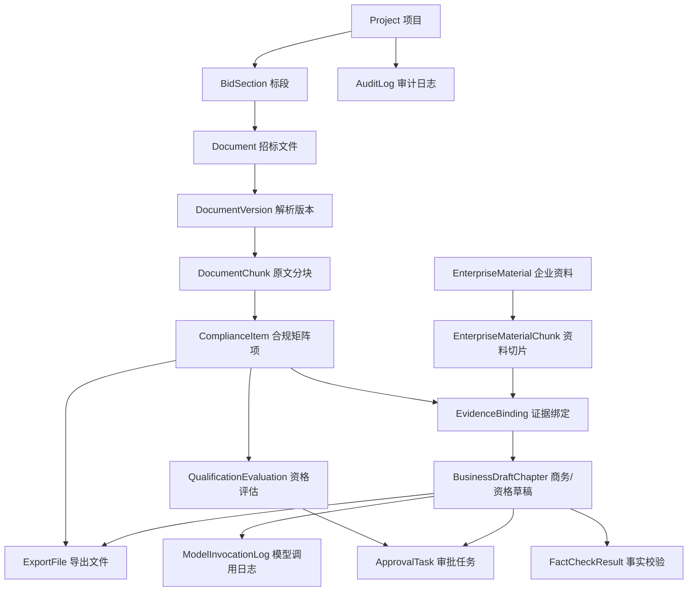

# 投标 Agent MVP-v1.0 核心功能流程说明

> 更新时间：2026-05-25
> 目的：把 MVP-v1.0 已具备的核心功能串成一条可演示、可评审、可优化的业务流程。
> 范围：通用投标辅助闭环；净化设备/洁净工程方向只做资料类型、技术响应入口和演示文案预埋。

## 1. 总体流程

MVP-v1.0 的主线不是“自动完成投标”，而是“辅助投标团队把招标文件读清楚、把响应证据找齐、把商务/资格草稿生成出来，并在关键动作上人工确认和留痕”。

更高一层的产品原则是：生成标书前的所有步骤，都应为最后模型生成最终产出提供尽可能完整、干净、可追溯、可校验的上下文。流程中的每个动作都要能回答一个问题：它为最终生成减少了什么不确定性，补齐了什么证据，或收紧了什么风险边界。

当前 v1.0 的流程定位：

| 阶段 | 用户目标 | 系统输出 | 人工责任 |
| --- | --- | --- | --- |
| 项目导入 | 快速建立项目和标段 | 项目、标段、基础信息草稿 | 确认项目信息是否正确 |
| 文件解析 | 把招标文件变成可处理数据 | 文件版本、解析分块、来源记录 | 修正解析错误并发布版本 |
| 合规矩阵 | 抽取必须响应的条款 | 矩阵项、风险、来源原文 | 确认、指派、补充判断 |
| 技术响应 | 识别技术类要求 | 技术响应/评分/待确认项 | 判断是否进入后续技术处理 |
| 企业资料 | 建立响应证据库 | 资质、人员、业绩、模板、产品资料 | 保证资料真实有效 |
| 证据绑定 | 把企业资料挂到条款上 | 矩阵证据绑定关系 | 选择最合适的证据 |
| 资格预评估 | 判断能不能投 | 满足/不满足/待确认、Go/No-Go 建议 | 最终参标决策 |
| 商务草稿 | 生成可编辑初稿 | 商务/资格章节草稿、引用证据 | 复核和修改文本 |
| 事实校验 | 避免编造事实 | 可验证/不一致/待确认结果 | 处理无法验证内容 |
| 审批导出 | 形成交付物和记录 | 审批任务、Word、Excel、审计日志 | 最终审核、盖章、提交 |

### 1.1 生成前上下文原则

标书生成不应只读取“当前页面上的文本”，而应读取一个经过前序流程整理过的生成上下文包。这个上下文包由以下内容组成：

| 上下文层 | 来源步骤 | 对最终生成的作用 |
| --- | --- | --- |
| 招标原文层 | 文件解析、Word 原文审阅、人工修正版本 | 确保模型知道依据哪份招标文件、哪个版本和哪段原文生成 |
| 响应要求层 | 合规矩阵、人工补漏、相似补票、重复项确认 | 确保模型知道必须响应什么、哪些条款已确认、哪些条款仍有风险 |
| 企业证据层 | 企业资料库、资料检索、证据绑定、无需绑定证据标记 | 确保模型只引用可用事实，并知道哪些条款不需要企业资料支撑 |
| 决策判断层 | 资格预评估、Go/No-Go、提交前核验 | 确保模型知道哪些资格、风险、缺项和阻塞状态不能绕过 |
| 草稿校验层 | 商务草稿、事实校验、审批任务、审计日志 | 确保模型生成后能被复核、追溯、再次校验和归档 |

因此，前序步骤的验收标准不只是“界面上能操作”，还包括：

1. 是否能沉淀为结构化上下文字段。
2. 是否能回链来源、版本、证据和人工判断。
3. 是否能区分已确认、待确认、缺材料、不适用和无需证据。
4. 是否能被最终草稿生成、事实校验、审批和导出复用。
5. 是否能在模型输出出错时用于追责、定位和修正。

## 2. 核心对象和数据流

关键数据口径：

| 对象 | 作用 | v1.0 关注点 |
| --- | --- | --- |
| `Project` / `BidSection` | 投标项目和标段容器 | 后续所有文件、矩阵、评估、草稿都挂在项目/标段下 |
| `Document` / `DocumentVersion` | 招标文件和解析版本 | 解析修正后必须形成新版本，不自动覆盖旧版本 |
| `DocumentChunk` | 招标文件原文片段 | 合规矩阵和来源回链的证据基础 |
| `ComplianceItem` | 合规矩阵项 | 支持资格、强制项、评分项、风险项、技术响应项 |
| `EnterpriseMaterial` | 企业资料库 | 支持资质、人员、业绩、商务模板，并预留产品目录、检测报告、产品图片、技术方案 |
| `ComplianceEvidenceBinding` | 矩阵项与企业资料的绑定 | 支撑资格评估、商务草稿和审计追溯 |
| `QualificationEvaluation` | 参标资格预评估 | 给出满足、不满足、缺材料、待确认和 Go/No-Go 建议 |
| `BusinessDraftChapter` | 商务/资格响应草稿 | 必须带引用证据，不能替代最终正式标书 |
| `ApprovalTask` | 人工关口 | 用于资格确认、章节确认、提交确认 |
| `AuditLog` / `ModelInvocationLog` | 留痕 | 记录关键业务动作、模型输入摘要、输出和证据引用 |

## 3. 详细流程

### 3.1 项目创建与导入

入口：

- 手工新建项目。
- 从 Word/PDF 文件导入项目。
- 从公告网页或公开附件 URL 导入项目。

流程：

1. 用户选择导入方式，上传文件或填写公开链接。
2. 系统读取文件/网页内容，抽取项目名称、标段、招标人、代理机构、预算、截止时间等基础信息。
3. 用户预览识别结果，修正必要字段。
4. 用户确认后，系统创建项目、标段、招标文件记录，并写入审计日志。

当前可优化点：

- 导入预览页可以增加“识别置信度”和“未识别字段提醒”，减少用户盲目确认。
- 如果公告网页包含多个附件，后续可以支持附件列表选择；v1.0 目前更适合单链接导入。
- 项目创建后可以自动提示下一步“查看解析结果/生成矩阵”，减少用户找入口的成本。

### 3.2 文件获取、解析和版本修正

入口：

- 项目工作台的“文件解析”页签。
- 项目导入后自动带入的招标文件。
- 用户后续补充上传的招标文件。

流程：

1. 系统保存原始文件、来源 URL、文件哈希、获取时间和存储路径。
2. 后台解析 Word/PDF，生成解析版本和分块。
3. 用户查看解析分块，发现错误时可人工修改。
4. 人工修改后发布新的解析版本。
5. 新版本不会自动覆盖合规矩阵，用户需要显式触发矩阵重生成。

当前可优化点：

- “解析版本”和“当前矩阵使用的版本”需要在 UI 上更显眼，否则用户容易忘记重生成矩阵。
- 解析分块适合增加全文搜索和章节目录定位，便于快速找到异常段落。
- 对 PDF 扫描件，v1.0 暂不承诺 OCR；后续如果客户样本大量是扫描件，需要提前纳入 v1.1 或生产化范围。

### 3.3 合规矩阵生成与处理

入口：

- 文件解析完成后的“生成合规矩阵”按钮。
- 文件列表中对指定解析版本手动重新生成。

流程：

1. 用户触发矩阵生成任务。
2. 系统从解析分块中抽取资格要求、强制响应项、评分项、风险项、技术响应项。
3. 每条矩阵项保存来源文件、版本、分块、页码或原文片段。
4. 用户在矩阵中筛选高风险、未确认、未绑定证据等项。
5. 用户逐条确认、指派责任人或批量确认低风险项。
6. 系统记录确认原因、责任人、状态变化和审计日志。

矩阵项处理状态建议：

| 状态 | 业务含义 | 用户动作 |
| --- | --- | --- |
| 待确认 | 系统已抽取，但尚未人工判断 | 查看来源、确认或指派 |
| 已确认 | 人工确认可响应或已处理 | 进入证据绑定或草稿 |
| 有风险 | 条款可能影响参标或响应完整性 | 补充证据、升级审批 |
| 缺材料 | 需要企业资料支撑但当前未找到 | 去企业资料库补齐 |

当前可优化点：

- 批量确认虽然提高效率，但需要继续限制高风险项不可批量通过。
- 矩阵项可以增加“处理建议优先级”，把致命资格项排在普通响应项前面。
- 来源预览可增加“上一段/下一段”，避免孤立片段导致误判。

### 3.4 技术响应预览

入口：

- 工作台“技术响应”页签。
- 右侧流程助手快捷入口“查看技术响应”。

流程：

1. 系统从合规矩阵中筛出 `technical_response`、`scoring` 和技术类 `other` 条款。
2. 页面展示技术/评分要求、类型、状态、风险、来源。
3. 用户查看来源原文，判断是否需要后续技术人员处理。
4. v1.0 不生成产品选型、投标示意图或技术标章节，只形成待确认事项。

当前可优化点：

- 技术响应目前是“从矩阵筛选出来的视图”，不是独立技术标生成链路；文案需要持续避免用户误解。
- 净化设备行业化字段，例如洁净等级、风量、过滤级别、噪声、压差、材质、验收标准，建议放到 v1.1 的结构化 schema。
- 技术响应页可以增加“转为技术待办/指派技术负责人”，让 v1.0 的预览更接近真实协作。

### 3.5 企业画像和企业资料库

入口：

- 企业资料库页面。
- 证据绑定弹窗中的企业资料检索。

流程：

1. 用户维护企业画像：业务范围、资质、人员能力、业绩、地域偏好、禁投规则。
2. 用户新增企业资料：资质证照、人员材料、业绩案例、商务模板、授权材料等。
3. v1.0 已预留净化方向资料类型：产品目录、检测报告、产品图片、技术方案。
4. 系统对企业资料生成检索切片。
5. 用户可按资料类型、关键词、数据等级、状态等过滤资料。

当前可优化点：

- 企业资料新增弹窗可以按资料类型动态显示字段，避免“所有类型一套表单”过于泛化。
- 产品图片当前只是资料类型预留，尚未进入图纸或技术标生成链路。
- 企业资料有效期、适用地区、适用行业可以在资格预评估中继续增强权重。

### 3.6 证据绑定和资料检索

入口：

- 工作台“证据处理”页签。
- 合规矩阵行内“绑定证据”。

流程：

1. 用户选择需要补证的矩阵项。
2. 系统根据矩阵项文本检索企业资料切片。
3. 检索结果展示资料名称、证据摘录、匹配分数和资料类型。
4. 用户选择合适资料绑定到矩阵项。
5. 绑定关系进入后续资格预评估和商务草稿生成。
6. 解除绑定时必须填写原因并写入审计。

当前可优化点：

- 检索目前偏轻量，适合增加“为什么推荐该资料”的解释。
- 同一矩阵项可能需要多个证据，页面可以区分主证据和辅助证据。
- 资料检索与矩阵处理可以做成左矩阵、右候选资料的连续工作台，减少弹窗切换。

### 3.7 资格预评估和 Go/No-Go

入口：

- 工作台“资格预评估”页签。
- 流程助手推荐动作。

流程：

1. 用户在合规矩阵和证据绑定有基础结果后触发资格评估。
2. 系统基于资格类条款、企业画像和企业资料判断满足情况。
3. 输出满足、不满足、缺材料、待确认和风险说明。
4. 系统生成整体 Go/No-Go 建议。
5. 用户人工确认评估结果和参标建议。

当前可优化点：

- 资格预评估建议和矩阵状态之间可以增加联动：确认某个资格项后自动刷新总体建议。
- Go/No-Go 建议应继续保持“辅助判断”定位，不能替代最终参标决策。
- 对禁投地区、禁投行业、联合体、信用中国等高风险规则，后续应形成更明确的规则来源。

### 3.8 商务/资格草稿生成

入口：

- 工作台“商务标章节”页签。
- 流程助手推荐“生成草稿”。

流程：

1. 用户确认矩阵和关键证据已基本完成。
2. 系统按章节生成商务/资格响应草稿。
3. 系统构建生成上下文包，包含目标章节、招标文件版本、相关矩阵项、证据绑定、无需绑定证据说明、资格评估结果、风险提示和输出格式约束。
4. 草稿内容基于合规矩阵和已绑定企业资料证据，不得编造项目名、人员、证书编号、金额和日期。
5. 每个章节保留证据引用。
6. 用户编辑章节，保存时填写修改原因。
7. 修改形成版本记录，并写入审计。

当前可优化点：

- 草稿生成前可以增加“生成准备度检查”，提示缺证据、未确认矩阵项和高风险项。
- 章节编辑区可以更明显地区分“系统生成内容”“人工修改内容”“证据引用内容”。
- v1.0 不生成技术标核心章节，避免与技术响应预览混淆。

### 3.9 事实性校验

入口：

- 商务/资格草稿生成或修改后。
- 用户手动重新运行事实校验。

流程：

1. 系统从草稿中识别项目名称、人员、证书编号、金额、日期等事实。
2. 系统与项目基础信息、企业资料和证据引用进行比对。
3. 校验结果分为可验证、一致性风险、无法验证、需人工确认等。
4. 用户处理风险项后再进入审批。

当前可优化点：

- 可以把事实校验结果直接嵌入章节正文旁边，而不是只作为独立列表。
- 对无法验证内容，应要求用户补证或明确人工确认原因。
- 后续可把事实校验结果作为审批任务的前置条件。

### 3.10 审批、导出和归档

入口：

- 工作台“审批任务”页签。
- 资格确认、章节确认、提交确认等动作。
- 合规矩阵导出和商务草稿 Word 导出按钮。

流程：

1. 系统为关键动作创建审批任务。
2. 审批人通过或退回，并填写处理意见。
3. 通过后，相关业务对象状态更新。
4. 用户导出合规矩阵 Excel 快照或商务/资格 Word 文档。
5. 导出文件、审批动作和关键状态变化写入审计日志。

当前可优化点：

- 审批任务可以增加阻塞原因，例如“仍有高风险矩阵项未确认”。
- 导出前可以统一做一次“提交前检查清单”。
- 未来生产化需要区分内部流转稿、正式定稿、外部提交稿。

### 3.11 流程助手

入口：

- 项目工作台右侧助手面板。

流程：

1. 系统根据当前项目状态推荐下一步。
2. 用户可点击快捷入口处理流程：解释当前条款、查看技术响应、检查缺项、整理审批意见。
3. 助手记录操作日志和本地提示。
4. v1.0 不承诺真实上下文问答、不执行复杂结构化 Agent 动作。

当前可优化点：

- 推荐动作可以更明确地绑定阻塞项，例如“3 条高风险未确认”“2 条资格项缺证据”。
- 操作日志可以按项目持久化，而不是只做页面态提示。
- 后续版本再接入真实上下文问答和多 Agent 编排；MVP1.1 已先完成受控模型任务和矩阵审阅纠错。

## 4. 一条完整演示脚本

这条脚本用于给客户或内部评审演示 MVP-v1.0：

1. 打开系统首页，选择一个净化设备/洁净工程方向的演示项目，或从招标文件导入新项目。
2. 在导入预览中确认项目名称、标段、招标人、截止时间等信息。
3. 进入项目工作台，查看文件解析结果和解析分块。
4. 人工修正一处解析文本，发布新解析版本。
5. 基于最新解析版本生成合规矩阵。
6. 打开合规矩阵，查看资格项、强制项、评分项、风险项和技术响应项。
7. 查看某条矩阵项来源原文，确认风险解释。
8. 切到技术响应页，展示系统已把洁净设备、检测报告、安装调试、验收等要求筛出来。
9. 进入企业资料库，展示资质、人员、业绩、商务模板，以及产品目录、检测报告、技术方案等净化方向资料类型。
10. 在证据处理页为缺证据矩阵项检索并绑定企业资料。
11. 运行资格预评估，查看满足、不满足、缺材料和 Go/No-Go 建议。
12. 人工确认资格评估结果。
13. 生成商务/资格草稿，查看章节内容和证据引用。
14. 运行事实性校验，处理无法验证或不一致内容。
15. 创建或处理审批任务。
16. 导出合规矩阵 Excel 和商务/资格 Word。
17. 查看审计日志和模型调用日志，证明关键动作可追溯。

## 5. 需要重点讨论的优化问题

建议评审时优先看这些点，因为它们最影响真实用户体验：

| 问题 | 当前做法 | 可讨论优化方向 |
| --- | --- | --- |
| 解析版本和矩阵版本关系 | 修正解析后需手动重生成矩阵 | 是否增加明显的版本差异提醒和一键重生成 |
| 矩阵项处理顺序 | 用户在表格中自行筛选 | 是否增加系统推荐优先级和阻塞项队列 |
| 证据绑定体验 | 弹窗检索并绑定企业资料 | 是否改成连续式左右工作台 |
| 技术响应定位 | v1.0 只做技术要求预览 | 是否增加“技术负责人待办”，但不生成技术标 |
| 草稿生成准备度 | 当前主要依赖用户判断 | 是否在生成前给出缺项检查和风险摘要 |
| 审批前置条件 | 审批任务可创建和处理 | 是否要求高风险/事实校验问题处理后才能提交审批 |
| 流程助手能力边界 | 流程导航，不做真实问答 | 是否把日志和推荐动作持久化到项目维度 |
| 净化行业靠拢程度 | 资料类型和技术响应入口预埋 | v1.1 是否优先做产品目录 schema 和技术参数抽取 |

## 6. v1.0 与 v1.1 边界

v1.0 已进入验收的内容：

- 通用投标辅助闭环：项目导入、文件解析、合规矩阵、企业资料、证据绑定、资格评估、商务/资格草稿、事实校验、审批导出、审计留痕。
- 净化方向预埋：产品目录、检测报告、产品图片、技术方案等资料类型；技术响应矩阵项；技术响应页面入口和演示文案。
- 流程助手：流程建议、快捷入口、主动提醒和操作日志。

v1.1 再进入的内容：

- 净化行业规则包和客户产品目录。
- 净化技术参数结构化抽取。
- 产品/设备选型辅助。
- 投标阶段示意图辅助。
- 技术标核心章节生成。
- 多 Agent 拆分和 Agent 级审计。
