# 投标 Agent 数据模型设计

> 版本：v0.3
> 日期：2026-05-25
> 范围：覆盖已完成的 MVP-v0.5、MVP-v1.0 和 MVP-v1.1 P0 + P1，兼顾 SaaS 多租户、安全审计、文件来源追溯、模型配置、合规矩阵审阅纠错和后续 RAG 扩展。

## 1. 设计目标

本数据模型优先支撑当前已完成的 MVP1.0/MVP1.1 业务闭环：

1. 手工创建项目和标段。
2. 上传招标文件，或通过公开资源站点链接获取招标文件。
3. 记录文件来源、获取时间、操作者、哈希和对象存储位置。
4. 异步解析文件，保存解析版本、页码、章节和原文片段。
5. 生成基础合规矩阵，并回链原始文件证据。
6. 支持人工修改、确认、责任人标记、风险标记和修改原因。
7. 支持高风险项逐条确认。
8. 导出 Excel 合规矩阵。
9. 覆盖基础审计日志。
10. 支持 Chat/LLM 模型配置和 API Key 加密存储。
11. 支持合规矩阵原文审阅、人工补漏、相似补票和重复项级联确认。

本模型暂不展开真实企业资料向量化 RAG、Embedding/Rerank、完整技术标生成、报价和复杂地方规则包管理，但会预留扩展边界，避免后续推倒重来。

## 2. 建模原则

### 2.1 租户与项目隔离

- 所有业务表必须带 `tenant_id`。
- 与投标业务直接相关的数据必须带 `project_id`，标段级数据同时带 `section_id`。
- 查询不能只依赖前端传参过滤，服务层必须统一注入租户、项目 ACL 和数据等级过滤。
- SaaS 对外提供时，数据库层建议补充 Row Level Security 或按租户分区策略，但 v0.5 可先由服务层强制实现。

### 2.2 证据优先

- 合规矩阵项必须保存 `source_document_id`、`source_version_id`、`source_chunk_id`、`source_page_no`。
- 文件必须保存来源类型、资源站点、原始 URL、获取时间、文件哈希和对象存储 key。
- 原始文件、解析版本、矩阵项和导出文件之间必须可追溯。

### 2.3 审计独立

- 审计日志是独立业务能力，不等同于运行日志。
- 文件上传、公开链接获取、解析、解析修正、矩阵修改、确认、导出、下载都必须写审计。
- 关键修改必须记录 `before_json`、`after_json` 和 `reason`。
- 审计日志普通用户不可删除，生产化阶段建议按月分区并做归档。

### 2.4 长任务持久化

- 文件下载、文档解析、矩阵生成、Excel 导出均按异步任务建模。
- 任务必须有状态、进度、失败原因、重试次数和幂等键。
- 重试任务不能产生重复文件、重复 chunk 或重复矩阵项。

### 2.5 对象存储不暴露永久地址

- 表中只保存 `object_key`、`bucket`、`sha256` 等元数据。
- 前端访问文件时，通过后端授权生成短期链接。
- 文件下载和预览动作也必须写入审计日志。

## 3. 核心实体关系

```mermaid
erDiagram
    TENANTS ||--o{ USERS : owns
    TENANTS ||--o{ PROJECTS : owns
    USERS ||--o{ PROJECT_MEMBERS : joins
    PROJECTS ||--o{ PROJECT_MEMBERS : has
    PROJECTS ||--o{ BID_SECTIONS : contains
    PROJECTS ||--o{ DOCUMENTS : owns
    BID_SECTIONS ||--o{ DOCUMENTS : uses
    DOCUMENTS ||--o{ DOCUMENT_VERSIONS : versions
    DOCUMENT_VERSIONS ||--o{ DOCUMENT_CHUNKS : chunks
    PROJECTS ||--o{ ASYNC_TASKS : schedules
    ASYNC_TASKS ||--o| FILE_ACQUISITION_TASKS : details
    ASYNC_TASKS ||--o| PARSE_TASKS : details
    PROJECTS ||--o{ COMPLIANCE_ITEMS : has
    BID_SECTIONS ||--o{ COMPLIANCE_ITEMS : has
    DOCUMENT_CHUNKS ||--o{ COMPLIANCE_ITEMS : supports
    PROJECTS ||--o{ EXPORT_FILES : exports
    ASYNC_TASKS ||--o| EXPORT_FILES : produces
    TENANTS ||--o{ AUDIT_LOGS : records

    TENANTS {
        uuid id PK
        string code
        string name
        string status
        timestamptz created_at
        timestamptz updated_at
    }

    USERS {
        uuid id PK
        uuid tenant_id FK
        string external_id
        string name
        string email
        string mobile
        string status
        timestamptz created_at
        timestamptz updated_at
    }

    PROJECTS {
        uuid id PK
        uuid tenant_id FK
        string name
        string purchaser
        string agency
        numeric budget_amount
        string region_code
        string industry_code
        string status
        timestamptz bid_deadline_at
        uuid created_by FK
        timestamptz created_at
        timestamptz updated_at
    }

    BID_SECTIONS {
        uuid id PK
        uuid tenant_id FK
        uuid project_id FK
        string code
        string name
        numeric budget_amount
        string status
        timestamptz bid_deadline_at
        uuid created_by FK
        timestamptz created_at
        timestamptz updated_at
    }

    DOCUMENTS {
        uuid id PK
        uuid tenant_id FK
        uuid project_id FK
        uuid section_id FK
        string doc_type
        string title
        string source_type
        string source_site
        text source_url
        string object_key
        string sha256
        uuid current_version_id FK
        string status
        timestamptz acquired_at
        timestamptz created_at
    }

    DOCUMENT_VERSIONS {
        uuid id PK
        uuid tenant_id FK
        uuid document_id FK
        integer version_no
        string version_label
        string object_key
        string sha256
        string parse_status
        timestamptz frozen_at
        uuid created_by FK
        text change_reason
        timestamptz created_at
    }

    DOCUMENT_CHUNKS {
        uuid id PK
        uuid tenant_id FK
        uuid document_id FK
        uuid document_version_id FK
        integer chunk_index
        integer page_no
        text heading_path
        text content_text
        string content_hash
        jsonb bbox_json
        jsonb table_json
        timestamptz created_at
    }

    COMPLIANCE_ITEMS {
        uuid id PK
        uuid tenant_id FK
        uuid project_id FK
        uuid section_id FK
        uuid source_document_id FK
        uuid source_version_id FK
        uuid source_chunk_id FK
        integer source_page_no
        string item_type
        text requirement_text
        string status
        string risk_level
        boolean is_mandatory
        uuid owner_user_id FK
        uuid confirmed_by FK
        timestamptz confirmed_at
        text modify_reason
        timestamptz updated_at
    }

    ASYNC_TASKS {
        uuid id PK
        uuid tenant_id FK
        uuid project_id FK
        uuid section_id FK
        string task_type
        string status
        string idempotency_key
        integer progress
        jsonb input_json
        jsonb output_json
        string error_code
        text error_message
        integer retry_count
        uuid created_by FK
        timestamptz created_at
        timestamptz updated_at
    }

    AUDIT_LOGS {
        uuid id PK
        uuid tenant_id FK
        uuid project_id FK
        uuid section_id FK
        uuid actor_user_id FK
        string action
        string object_type
        uuid object_id
        jsonb before_json
        jsonb after_json
        text reason
        string request_id
        string trace_id
        timestamptz created_at
    }
```



## 4. MVP-v0.5 表设计

### 4.1 `tenants` 组织/租户表

用于 SaaS 多租户隔离。即使 v0.5 本地部署，也建议保留租户维度。

| 字段 | 类型 | 必填 | 说明 |
| --- | --- | --- | --- |
| `id` | UUID | 是 | 主键 |
| `code` | varchar(64) | 是 | 租户编码，唯一 |
| `name` | varchar(200) | 是 | 租户名称 |
| `status` | varchar(32) | 是 | `active`、`disabled` |
| `created_at` | timestamptz | 是 | 创建时间 |
| `updated_at` | timestamptz | 是 | 更新时间 |

关键约束：

- `UNIQUE(code)`
- `status` 只能由管理员或系统运维变更。

### 4.2 `users` 用户表

保存平台用户基础信息。复杂身份认证可接入企业 SSO，本表保存业务侧用户映射。

| 字段 | 类型 | 必填 | 说明 |
| --- | --- | --- | --- |
| `id` | UUID | 是 | 主键 |
| `tenant_id` | UUID | 是 | 租户 |
| `external_id` | varchar(128) | 否 | SSO/LDAP/企业微信等外部账号 ID |
| `name` | varchar(100) | 是 | 用户姓名 |
| `email` | varchar(200) | 否 | 邮箱 |
| `mobile` | varchar(32) | 否 | 手机号 |
| `status` | varchar(32) | 是 | `active`、`disabled` |
| `created_at` | timestamptz | 是 | 创建时间 |
| `updated_at` | timestamptz | 是 | 更新时间 |

关键索引：

- `idx_users_tenant_status(tenant_id, status)`
- `uq_users_tenant_external(tenant_id, external_id)`

### 4.3 `projects` 投标项目表

项目是权限、任务、文件、矩阵和审计的核心边界。

| 字段 | 类型 | 必填 | 说明 |
| --- | --- | --- | --- |
| `id` | UUID | 是 | 主键 |
| `tenant_id` | UUID | 是 | 租户 |
| `name` | varchar(300) | 是 | 项目名称 |
| `purchaser` | varchar(300) | 否 | 采购人 |
| `agency` | varchar(300) | 否 | 代理机构 |
| `budget_amount` | numeric(18,2) | 否 | 预算金额 |
| `region_code` | varchar(64) | 否 | 地区编码 |
| `industry_code` | varchar(64) | 否 | 行业编码 |
| `notice_url` | text | 否 | 公告链接 |
| `status` | varchar(32) | 是 | 项目状态 |
| `bid_deadline_at` | timestamptz | 否 | 投标截止时间 |
| `created_by` | UUID | 是 | 创建人 |
| `created_at` | timestamptz | 是 | 创建时间 |
| `updated_at` | timestamptz | 是 | 更新时间 |
| `archived_at` | timestamptz | 否 | 归档时间 |

建议状态：

- `draft`：草稿
- `pending_files`：待上传/获取文件
- `parsing`：解析中
- `pending_confirm`：待确认
- `need_materials`：待补充
- `confirmed`：已确认
- `exported`：已导出
- `archived`：已归档

关键索引：

- `idx_projects_tenant_status_deadline(tenant_id, status, bid_deadline_at)`
- `idx_projects_tenant_name(tenant_id, name)`

### 4.4 `bid_sections` 标段表

一个项目可以包含多个标段。标段有独立文件、矩阵、责任人和截止时间。

| 字段 | 类型 | 必填 | 说明 |
| --- | --- | --- | --- |
| `id` | UUID | 是 | 主键 |
| `tenant_id` | UUID | 是 | 租户 |
| `project_id` | UUID | 是 | 项目 |
| `code` | varchar(64) | 否 | 标段编号 |
| `name` | varchar(300) | 是 | 标段名称 |
| `budget_amount` | numeric(18,2) | 否 | 标段预算 |
| `status` | varchar(32) | 是 | 标段状态 |
| `bid_deadline_at` | timestamptz | 否 | 标段截止时间，可覆盖项目截止时间 |
| `created_by` | UUID | 是 | 创建人 |
| `created_at` | timestamptz | 是 | 创建时间 |
| `updated_at` | timestamptz | 是 | 更新时间 |

关键索引：

- `idx_bid_sections_tenant_project(tenant_id, project_id)`
- `idx_bid_sections_tenant_status(tenant_id, status)`

### 4.5 `project_members` 项目成员表

用于项目级授权和首页“我的待办”过滤。

| 字段 | 类型 | 必填 | 说明 |
| --- | --- | --- | --- |
| `id` | UUID | 是 | 主键 |
| `tenant_id` | UUID | 是 | 租户 |
| `project_id` | UUID | 是 | 项目 |
| `user_id` | UUID | 是 | 用户 |
| `role_code` | varchar(64) | 是 | 项目角色 |
| `status` | varchar(32) | 是 | `active`、`removed` |
| `created_by` | UUID | 是 | 添加人 |
| `created_at` | timestamptz | 是 | 创建时间 |

建议角色：

- `owner`：业务负责人
- `editor`：标书编辑
- `qualification_manager`：资质管理员
- `compliance_reviewer`：合规复核
- `auditor`：审计查看

关键约束：

- `UNIQUE(tenant_id, project_id, user_id, role_code)`

### 4.6 `documents` 文件表

保存文件的业务身份和来源信息。一个文件可有多个解析/修正版本。

| 字段 | 类型 | 必填 | 说明 |
| --- | --- | --- | --- |
| `id` | UUID | 是 | 主键 |
| `tenant_id` | UUID | 是 | 租户 |
| `project_id` | UUID | 是 | 项目 |
| `section_id` | UUID | 否 | 标段；项目级文件可为空 |
| `doc_type` | varchar(64) | 是 | `tender`、`clarification`、`attachment`、`enterprise_material`、`export` |
| `title` | varchar(300) | 是 | 文件标题 |
| `source_type` | varchar(32) | 是 | `upload`、`public_url`、`manual_import` |
| `source_site` | varchar(200) | 否 | 资源站点名称，如政府采购网、公共资源交易平台 |
| `source_url` | text | 否 | 原始 URL；上传文件可为空 |
| `original_filename` | varchar(300) | 是 | 原始文件名 |
| `content_type` | varchar(128) | 否 | MIME 类型 |
| `file_ext` | varchar(32) | 否 | 文件扩展名 |
| `file_size` | bigint | 是 | 文件大小 |
| `sha256` | char(64) | 是 | 文件哈希 |
| `bucket` | varchar(128) | 是 | 对象存储 bucket |
| `object_key` | varchar(512) | 是 | 对象存储 key |
| `status` | varchar(32) | 是 | 文件状态 |
| `current_version_id` | UUID | 否 | 当前解析版本 |
| `created_by` | UUID | 是 | 上传/获取发起人 |
| `acquired_at` | timestamptz | 是 | 上传或下载完成时间 |
| `created_at` | timestamptz | 是 | 创建时间 |
| `updated_at` | timestamptz | 是 | 更新时间 |

建议状态：

- `pending`：待处理
- `available`：可用
- `parsing`：解析中
- `parse_failed`：解析失败
- `deleted`：已删除

关键索引：

- `idx_documents_tenant_project_section(tenant_id, project_id, section_id)`
- `idx_documents_tenant_sha256(tenant_id, sha256)`
- `idx_documents_source_url_hash(tenant_id, source_type, sha256)`

注意：

- `source_url` 只记录来源，不作为前端访问地址。
- `object_key` 不直接暴露给浏览器。
- 删除建议先软删除，保留审计和版本链。

### 4.7 `document_versions` 文件解析版本表

文件上传后创建初始版本。人工修正解析结果时产生新版本，旧版本归档。

| 字段 | 类型 | 必填 | 说明 |
| --- | --- | --- | --- |
| `id` | UUID | 是 | 主键 |
| `tenant_id` | UUID | 是 | 租户 |
| `document_id` | UUID | 是 | 文件 |
| `version_no` | integer | 是 | 递增版本号，从 1 开始 |
| `version_label` | varchar(64) | 是 | 展示标签，如 `v0.1`、`v0.2` |
| `object_key` | varchar(512) | 是 | 对应该版本的解析产物或修正产物 |
| `sha256` | char(64) | 是 | 版本内容哈希 |
| `parse_status` | varchar(32) | 是 | 解析状态 |
| `parser_name` | varchar(100) | 否 | 解析器名称 |
| `parser_version` | varchar(64) | 否 | 解析器版本 |
| `frozen_at` | timestamptz | 否 | 冻结时间 |
| `created_by` | UUID | 是 | 创建人或系统用户 |
| `change_reason` | text | 否 | 人工修正原因或版本说明 |
| `created_at` | timestamptz | 是 | 创建时间 |

关键约束：

- `UNIQUE(tenant_id, document_id, version_no)`
- 冻结版本不可原地覆盖，只能创建新版本。

### 4.8 `document_chunks` 文档片段表

用于合规矩阵证据回链。v0.5 不做 RAG，也建议保存 chunk，因为矩阵来源、页码定位和后续知识库都依赖它。

| 字段 | 类型 | 必填 | 说明 |
| --- | --- | --- | --- |
| `id` | UUID | 是 | 主键 |
| `tenant_id` | UUID | 是 | 租户 |
| `document_id` | UUID | 是 | 文件 |
| `document_version_id` | UUID | 是 | 文件版本 |
| `section_id` | UUID | 否 | 标段 |
| `chunk_index` | integer | 是 | 片段序号 |
| `page_no` | integer | 否 | 页码 |
| `heading_path` | text | 否 | 标题路径，如 `第三章/资格要求` |
| `content_text` | text | 是 | 原文片段 |
| `content_hash` | char(64) | 是 | 片段哈希 |
| `bbox_json` | jsonb | 否 | 页面坐标，便于后续截图定位 |
| `table_json` | jsonb | 否 | 表格结构 |
| `created_at` | timestamptz | 是 | 创建时间 |

关键索引：

- `idx_chunks_tenant_version_page(tenant_id, document_version_id, page_no)`
- `idx_chunks_tenant_document_index(tenant_id, document_id, chunk_index)`
- 后续 v1.0 可增加全文索引：`GIN(to_tsvector('simple', content_text))`

### 4.9 `async_tasks` 异步任务表

所有下载、解析、矩阵生成、导出任务统一记录在此表，便于工作台展示任务进度和重试。

| 字段 | 类型 | 必填 | 说明 |
| --- | --- | --- | --- |
| `id` | UUID | 是 | 主键 |
| `tenant_id` | UUID | 是 | 租户 |
| `project_id` | UUID | 否 | 项目 |
| `section_id` | UUID | 否 | 标段 |
| `task_type` | varchar(64) | 是 | `file_acquisition`、`document_parse`、`matrix_generate`、`excel_export` |
| `status` | varchar(32) | 是 | 任务状态 |
| `idempotency_key` | varchar(128) | 是 | 幂等键 |
| `progress` | integer | 是 | 0-100 |
| `input_json` | jsonb | 否 | 输入参数摘要 |
| `output_json` | jsonb | 否 | 输出结果摘要 |
| `error_code` | varchar(100) | 否 | 错误码 |
| `error_message` | text | 否 | 错误说明 |
| `retry_count` | integer | 是 | 重试次数 |
| `max_retries` | integer | 是 | 最大重试次数 |
| `created_by` | UUID | 是 | 发起人 |
| `started_at` | timestamptz | 否 | 开始时间 |
| `finished_at` | timestamptz | 否 | 结束时间 |
| `created_at` | timestamptz | 是 | 创建时间 |
| `updated_at` | timestamptz | 是 | 更新时间 |

建议状态：

- `pending`
- `running`
- `succeeded`
- `failed`
- `canceled`
- `retrying`

关键约束：

- `UNIQUE(tenant_id, task_type, idempotency_key)`
- `progress` 范围 0-100。

### 4.10 `file_acquisition_tasks` 资源站点文件获取任务表

保存公开链接获取文件的安全校验和下载结果。v0.5 只支持用户手工录入公开链接。

| 字段 | 类型 | 必填 | 说明 |
| --- | --- | --- | --- |
| `id` | UUID | 是 | 主键 |
| `tenant_id` | UUID | 是 | 租户 |
| `task_id` | UUID | 是 | 关联 `async_tasks` |
| `project_id` | UUID | 是 | 项目 |
| `section_id` | UUID | 否 | 标段 |
| `source_url` | text | 是 | 用户输入的原始 URL |
| `normalized_url` | text | 否 | 规范化后的 URL |
| `source_site` | varchar(200) | 否 | 资源站点名称 |
| `fetch_method` | varchar(64) | 是 | `manual_public_url` |
| `validation_status` | varchar(32) | 是 | URL 安全校验状态 |
| `blocked_reason` | text | 否 | 被拦截原因 |
| `http_status` | integer | 否 | 下载响应状态码 |
| `content_type` | varchar(128) | 否 | 响应内容类型 |
| `content_length` | bigint | 否 | 响应文件大小 |
| `redirect_chain_json` | jsonb | 否 | 重定向链路 |
| `target_document_id` | UUID | 否 | 下载成功后创建的文件 |
| `created_at` | timestamptz | 是 | 创建时间 |
| `updated_at` | timestamptz | 是 | 更新时间 |

安全约束：

- 仅允许 `https` 和必要时受控的 `http`。
- 禁止内网地址、回环地址、元数据地址、文件协议和非标准端口。
- 限制文件大小、下载超时、重定向次数和 Content-Type。
- URL 校验失败必须写业务审计事件 `document.public_url_blocked`；生产化阶段可同步安全审计事件 `security.url_blocked`。

### 4.11 `parse_tasks` 文档解析任务表

保存解析器、解析选项和结果摘要。任务公共状态仍在 `async_tasks` 中。

| 字段 | 类型 | 必填 | 说明 |
| --- | --- | --- | --- |
| `id` | UUID | 是 | 主键 |
| `tenant_id` | UUID | 是 | 租户 |
| `task_id` | UUID | 是 | 关联 `async_tasks` |
| `document_id` | UUID | 是 | 文件 |
| `document_version_id` | UUID | 是 | 目标解析版本 |
| `parser_type` | varchar(64) | 是 | `pdf_text`、`word`、`ocr`、`excel` |
| `parser_name` | varchar(100) | 是 | 具体解析器 |
| `parser_version` | varchar(64) | 否 | 解析器版本 |
| `options_json` | jsonb | 否 | OCR、表格解析等参数 |
| `result_summary_json` | jsonb | 否 | 页数、chunk 数、表格数、失败页等 |
| `created_at` | timestamptz | 是 | 创建时间 |
| `updated_at` | timestamptz | 是 | 更新时间 |

关键要求：

- 解析成功后写入 `document_chunks`。
- 解析失败时不得创建半成品当前版本。
- 人工修正解析结果后，应创建新 `document_versions`，并触发 `matrix_generate` 或增量更新任务。

### 4.12 `compliance_items` 合规矩阵项表

合规矩阵核心表。每条矩阵项必须回链证据来源；MVP1.1 在此基础上增加原文审阅、人工补漏、相似补票和重复项关联字段。

| 字段 | 类型 | 必填 | 说明 |
| --- | --- | --- | --- |
| `id` | UUID | 是 | 主键 |
| `tenant_id` | UUID | 是 | 租户 |
| `project_id` | UUID | 是 | 项目 |
| `section_id` | UUID | 是 | 标段 |
| `source_document_id` | UUID | 是 | 来源文件 |
| `source_version_id` | UUID | 是 | 来源文件版本 |
| `source_chunk_id` | UUID | 条件必填 | 来源片段；系统生成项必须有值，人工临时项可为空但不得确认 |
| `source_page_no` | integer | 否 | 来源页码 |
| `item_type` | varchar(64) | 是 | `qualification`、`mandatory_response`、`format`、`deadline`、`scoring`、`reference_info`、`technical_response`、`other` |
| `requirement_text` | text | 是 | 招标要求原文或摘要 |
| `normalized_requirement` | text | 否 | 规范化要求，用于去重和比较 |
| `response_suggestion` | text | 否 | 响应建议 |
| `evidence_text` | text | 否 | 证据片段冗余快照 |
| `explanation_json` | jsonb | 否 | 模型/规则解释、分类理由、拆分理由、来源摘录、人工复核提示等扩展信息 |
| `dedup_key` | varchar(160) | 否 | 归一化后的疑似重复 key，用于候选关联提示，不自动启用级联 |
| `duplicate_group_id` | UUID | 否 | 人工确认后的重复/相同要求关联组 ID |
| `duplicate_group_confirmed_at` | timestamptz | 否 | 关联组人工确认时间 |
| `duplicate_group_confirmed_by` | UUID | 否 | 关联组确认人 |
| `duplicate_group_status` | varchar(32) | 否 | `confirmed`、`unlinked` 等关联状态 |
| `selected_text` | text | 否 | 人工从原文划选新增时的来源文字 |
| `selection_start_offset` | integer | 否 | 人工划选文字在来源 chunk 中的起始偏移 |
| `selection_end_offset` | integer | 否 | 人工划选文字在来源 chunk 中的结束偏移 |
| `source_create_method` | varchar(32) | 否 | `model`、`rule`、`manual_selection`、`similar_candidate` 等来源创建方式 |
| `status` | varchar(32) | 是 | 矩阵项状态 |
| `risk_level` | varchar(32) | 是 | `low`、`medium`、`high` |
| `is_mandatory` | boolean | 是 | 是否强制项 |
| `is_batch_confirm_allowed` | boolean | 是 | 是否允许批量确认 |
| `owner_user_id` | UUID | 否 | 责任人 |
| `confidence_score` | numeric(5,4) | 否 | 抽取置信度 |
| `confirmed_by` | UUID | 否 | 确认人 |
| `confirmed_at` | timestamptz | 否 | 确认时间 |
| `modified_by` | UUID | 否 | 最后修改人 |
| `modified_at` | timestamptz | 否 | 最后修改时间 |
| `modify_reason` | text | 否 | 最后修改原因 |
| `created_by` | UUID | 是 | 创建人或系统用户 |
| `created_at` | timestamptz | 是 | 创建时间 |
| `updated_at` | timestamptz | 是 | 更新时间 |
| `deleted_at` | timestamptz | 否 | 软删除时间 |

建议状态：

- `draft`：系统抽取草稿
- `pending_confirm`：待人工确认
- `confirmed`：已确认
- `needs_material`：缺材料
- `rejected`：已驳回/不适用
- `superseded`：因解析版本更新被替代

关键规则：

- 无 `source_chunk_id` 的矩阵项不得进入 `confirmed`。
- `risk_level = high`、`is_mandatory = true`、`status = needs_material` 的项不得批量确认。
- 人工修改 `requirement_text`、`status`、`risk_level`、`owner_user_id`、`response_suggestion` 时必须填写 `modify_reason` 并写审计。
- `evidence_text` 是来源片段的冗余快照，方便导出和审计；权威来源仍是 `source_chunk_id`。
- `dedup_key` 只能用于疑似关联提示；只有人工确认 `duplicate_group_id` 后，状态级联才允许生效。
- 级联确认只同步确认状态、确认人、确认时间等低风险状态；风险等级、强制属性、条目类型不得静默同步。
- `source_create_method = manual_selection` 时必须保留 `selected_text` 和 `source_chunk_id`，offset 可为空但应尽力保存。

建议索引：

- `idx_cm_tenant_project_section(tenant_id, project_id, section_id)`
- `idx_cm_filter(tenant_id, project_id, section_id, status, risk_level, owner_user_id)`
- `idx_cm_source(tenant_id, source_document_id, source_version_id, source_chunk_id)`
- `idx_cm_dedup(tenant_id, project_id, section_id, dedup_key)`
- `idx_cm_duplicate_group(tenant_id, project_id, section_id, duplicate_group_id)`
- `idx_cm_updated(tenant_id, project_id, updated_at)`

### 4.13 `export_files` 导出文件表

记录合规矩阵 Excel 等导出产物。

| 字段 | 类型 | 必填 | 说明 |
| --- | --- | --- | --- |
| `id` | UUID | 是 | 主键 |
| `tenant_id` | UUID | 是 | 租户 |
| `project_id` | UUID | 是 | 项目 |
| `section_id` | UUID | 否 | 标段；项目汇总导出可为空 |
| `task_id` | UUID | 否 | 关联导出任务 |
| `export_type` | varchar(64) | 是 | `compliance_matrix_excel` |
| `file_name` | varchar(300) | 是 | 导出文件名 |
| `bucket` | varchar(128) | 是 | 对象存储 bucket |
| `object_key` | varchar(512) | 是 | 对象存储 key |
| `sha256` | char(64) | 是 | 导出文件哈希 |
| `filter_json` | jsonb | 否 | 导出时筛选条件 |
| `source_snapshot_json` | jsonb | 否 | 导出涉及的文件版本、矩阵版本摘要 |
| `status` | varchar(32) | 是 | `generating`、`available`、`failed`、`deleted` |
| `created_by` | UUID | 是 | 导出人 |
| `created_at` | timestamptz | 是 | 创建时间 |

关键要求：

- 导出前必须二次确认。
- 导出记录必须写审计，包含筛选条件和文件哈希。
- 导出文件访问仍走短期授权链接。

### 4.14 `audit_logs` 审计日志表

记录关键业务动作和安全动作。

| 字段 | 类型 | 必填 | 说明 |
| --- | --- | --- | --- |
| `id` | UUID | 是 | 主键 |
| `tenant_id` | UUID | 是 | 租户 |
| `project_id` | UUID | 否 | 项目 |
| `section_id` | UUID | 否 | 标段 |
| `actor_user_id` | UUID | 否 | 操作者；系统任务可为空 |
| `actor_type` | varchar(32) | 是 | `user`、`system`、`worker` |
| `action` | varchar(100) | 是 | 动作编码 |
| `object_type` | varchar(100) | 是 | 对象类型 |
| `object_id` | UUID | 否 | 对象 ID |
| `before_json` | jsonb | 否 | 修改前 |
| `after_json` | jsonb | 否 | 修改后 |
| `reason` | text | 否 | 修改原因 |
| `ip_address` | inet | 否 | IP |
| `user_agent` | text | 否 | User-Agent |
| `request_id` | varchar(128) | 否 | 请求 ID |
| `trace_id` | varchar(128) | 否 | 链路 ID |
| `severity` | varchar(32) | 是 | `info`、`warning`、`critical` |
| `created_at` | timestamptz | 是 | 创建时间 |

当前必须覆盖的动作：

- `project.created`
- `section.created`
- `document.uploaded`
- `document.public_url_requested`
- `document.public_url_blocked`
- `document.public_url_downloaded`
- `security.url_blocked`
- `security.access_denied`
- `document.parse_started`
- `document.parse_failed`
- `document.parse_succeeded`
- `document.version_created`
- `matrix.generated`
- `matrix.item_updated`
- `matrix.item_confirmed`
- `matrix.batch_assigned`
- `matrix.batch_confirm_denied`
- `export.excel_requested`
- `export.excel_succeeded`
- `export.excel_failed`
- `file.previewed`
- `file.downloaded`
- `model_config.updated`
- `model_config.tested`
- `model.invocation_succeeded`
- `model.invocation_failed`
- `matrix.item_created_from_source`
- `matrix.similar_candidate_applied`
- `matrix.duplicate_group_confirmed`
- `matrix.duplicate_group_unlinked`
- `matrix.duplicate_group_split`
- `matrix.cascade_confirmed`

建议索引：

- `idx_audit_tenant_project_time(tenant_id, project_id, created_at DESC)`
- `idx_audit_object(tenant_id, object_type, object_id, created_at DESC)`
- `idx_audit_action_time(tenant_id, action, created_at DESC)`

生产化建议：

- 按月或按季度分区。
- 保留在线查询窗口，历史日志归档到低成本存储。
- 安全相关日志可同步到 SIEM。

### 4.15 `ai_model_configs` 模型配置表

记录租户级模型配置。MVP1.1 正式使用 `capability = chat`，预留 `embedding` 和 `rerank`；API Key 加密存储，读取接口只返回脱敏值。

| 字段 | 类型 | 必填 | 说明 |
| --- | --- | --- | --- |
| `id` | UUID | 是 | 主键 |
| `tenant_id` | UUID | 是 | 租户 |
| `capability` | varchar(32) | 是 | `chat`、`embedding`、`rerank`；当前正式使用 `chat` |
| `provider` | varchar(64) | 是 | `mock`、`deepseek`、`openai_compatible` |
| `base_url` | text | 否 | OpenAI-compatible 服务地址 |
| `simple_model` | varchar(128) | 否 | 简单任务模型名 |
| `complex_model` | varchar(128) | 否 | 复杂任务模型名 |
| `timeout_seconds` | numeric(8,2) | 是 | 调用超时时间 |
| `enabled` | boolean | 是 | 是否启用 |
| `api_key_encrypted` | text | 否 | AES-256-GCM 加密后的 API Key |
| `api_key_masked` | varchar(128) | 否 | 脱敏展示值 |
| `encryption_key_version` | varchar(32) | 否 | 加密密钥版本 |
| `last_test_status` | varchar(32) | 否 | `success`、`failed`、`skipped` |
| `last_test_message` | text | 否 | 最近连接测试摘要 |
| `last_tested_at` | timestamptz | 否 | 最近测试时间 |
| `created_by` | UUID | 是 | 创建人 |
| `updated_by` | UUID | 是 | 更新人 |
| `created_at` | timestamptz | 是 | 创建时间 |
| `updated_at` | timestamptz | 是 | 更新时间 |

关键规则：

- 同一租户同一 `capability` 只能有一条配置。
- 新写入 API Key 时，后端必须存在 `MODEL_CONFIG_ENCRYPTION_KEY`。
- 明文 API Key 不得返回前端，不得写入审计日志和模型调用日志。
- 模型调用优先使用启用的 DB 配置；没有可用 DB 配置时回退 `LLM_*` 环境变量；仍不可用则进入 mock/规则兜底。

建议索引：

- `uq_ai_model_configs_tenant_capability(tenant_id, capability)`
- `idx_ai_model_configs_tenant_enabled(tenant_id, capability, enabled)`

## 5. 核心状态枚举

### 5.1 文件来源 `document.source_type`

| 值 | 说明 |
| --- | --- |
| `upload` | 本地上传 |
| `public_url` | 用户录入公开链接获取 |
| `manual_import` | 后台或脚本导入 |

### 5.2 异步任务状态 `async_tasks.status`

| 值 | 说明 |
| --- | --- |
| `pending` | 等待执行 |
| `running` | 执行中 |
| `retrying` | 等待重试 |
| `succeeded` | 成功 |
| `failed` | 失败 |
| `canceled` | 已取消 |

### 5.3 合规矩阵状态 `compliance_items.status`

| 值 | 说明 |
| --- | --- |
| `draft` | 系统抽取草稿 |
| `pending_confirm` | 待确认 |
| `confirmed` | 已确认 |
| `needs_material` | 缺材料 |
| `rejected` | 不适用或驳回 |
| `superseded` | 被新版本替代 |

### 5.4 风险等级 `risk_level`

| 值 | 说明 |
| --- | --- |
| `low` | 低风险 |
| `medium` | 中风险 |
| `high` | 高风险，需要逐条人工确认 |

## 6. 关键业务链路数据流

### 6.1 本地上传招标文件

1. 创建 `documents`，`source_type = upload`。
2. 上传文件到对象存储，保存 `bucket`、`object_key`、`sha256`。
3. 创建 `document_versions` 初始版本。
4. 创建 `async_tasks(task_type = document_parse)` 和 `parse_tasks`。
5. 写入审计 `document.uploaded`、`document.parse_started`。

### 6.2 公开资源站点链接获取文件

1. 用户录入公开附件链接和资源站点名称。
2. 创建 `async_tasks(task_type = file_acquisition)`。
3. 创建 `file_acquisition_tasks`，记录原始 URL。
4. Worker 执行 URL 安全校验。
5. 校验失败：更新任务失败，写 `document.public_url_blocked`。
6. 下载成功：上传对象存储，创建 `documents` 和 `document_versions`。
7. 写 `document.public_url_downloaded`，随后进入解析任务。

### 6.3 文档解析到合规矩阵

1. Worker 读取当前 `document_versions`。
2. 解析结果写入 `document_chunks`。
3. 抽取资格要求和强制响应项。
4. 创建 `compliance_items`，绑定来源文件、版本、chunk、页码。
5. 无来源或低置信度结果进入 `pending_confirm`。
6. 写 `document.parse_succeeded` 和 `matrix.generated`。

### 6.4 人工修正解析结果

1. 用户基于现有版本修正解析文本或结构。
2. 创建新的 `document_versions`，记录 `change_reason`。
3. 旧版本保留，不原地覆盖。
4. 触发 `matrix_generate` 任务或增量更新任务。
5. 受影响矩阵项标记为 `superseded` 或更新来源。
6. 写入审计 `document.version_created` 和 `matrix.generated`。

### 6.5 人工修改/确认矩阵项

1. 用户修改矩阵项字段时必须填写修改原因。
2. 服务层读取旧值，更新 `compliance_items`。
3. 写 `audit_logs`，记录 `before_json`、`after_json`、`reason`。
4. 高风险、强制项、缺材料项确认时必须单条执行。
5. 批量操作被拒绝时写 `matrix.batch_confirm_denied`。

### 6.6 导出 Excel

1. 用户触发导出并二次确认。
2. 创建 `async_tasks(task_type = excel_export)`。
3. Worker 根据筛选条件生成 Excel。
4. 导出文件上传对象存储，创建 `export_files`。
5. 写 `export.excel_succeeded`，记录筛选条件、来源版本和文件哈希。

## 7. 索引与性能策略

MVP-v0.5 的性能目标是 100 行合规矩阵加载和筛选小于 2 秒。建议优先实现以下索引：

| 表 | 索引 | 目的 |
| --- | --- | --- |
| `projects` | `(tenant_id, status, bid_deadline_at)` | 首页项目、截止提醒 |
| `bid_sections` | `(tenant_id, project_id)` | 项目树和标段列表 |
| `documents` | `(tenant_id, project_id, section_id)` | 文件列表 |
| `documents` | `(tenant_id, sha256)` | 文件去重 |
| `document_chunks` | `(tenant_id, document_version_id, page_no)` | 证据定位 |
| `compliance_items` | `(tenant_id, project_id, section_id, status, risk_level, owner_user_id)` | 矩阵筛选 |
| `compliance_items` | `(tenant_id, source_document_id, source_version_id, source_chunk_id)` | 来源追溯 |
| `async_tasks` | `(tenant_id, task_type, status, created_at DESC)` | 任务列表 |
| `async_tasks` | `(tenant_id, task_type, idempotency_key)` | 幂等 |
| `audit_logs` | `(tenant_id, project_id, created_at DESC)` | 项目审计 |
| `audit_logs` | `(tenant_id, object_type, object_id, created_at DESC)` | 对象审计 |

前端表格仍应支持分页、固定列和横向滚动，不能依赖一次性加载无限数据。

## 8. 数据安全约束

### 8.1 查询约束

所有业务查询必须具备以下过滤条件：

```text
tenant_id = current_tenant_id
AND project_id IN current_user_authorized_project_ids
```

项目级文件、矩阵、任务和审计查询不能只按 `id` 查询后再判断权限，应在查询条件中直接加入租户和项目范围。

### 8.2 文件访问

- 对象存储 key 不返回给前端。
- 后端根据权限生成短期链接。
- 预览、下载、导出下载都写审计。
- 生产化阶段可按租户隔离 bucket 或对象 key 前缀。

建议对象 key 结构：

```text
tenant/{tenant_id}/project/{project_id}/section/{section_id}/documents/{document_id}/v{version_no}/{filename}
tenant/{tenant_id}/project/{project_id}/exports/{export_file_id}/{filename}
```

### 8.3 公开 URL 获取

必须保存安全校验结果：

- 原始 URL
- 规范化 URL
- 重定向链路
- HTTP 状态
- Content-Type
- Content-Length
- 拦截原因

禁止下载：

- `file://`、`ftp://`、`gopher://` 等非业务协议。
- `127.0.0.0/8`、`10.0.0.0/8`、`172.16.0.0/12`、`192.168.0.0/16`、`169.254.0.0/16` 等内网或元数据地址。
- 超过配置大小的文件。
- 非允许扩展名或 MIME 类型。

## 9. v1.0 扩展表预留

以下表不建议进入 MVP-v0.5 首批开发，但数据模型要预留关联点。

| 模块 | 建议表 | 关联点 |
| --- | --- | --- |
| 企业画像 | `enterprise_profiles`、`enterprise_qualifications`、`enterprise_cases`、`enterprise_personnel` | 后续绑定 `tenant_id`、`project_id`、`compliance_item_id` |
| 知识库/RAG | `knowledge_assets`、`knowledge_chunks`、`vector_embeddings`、`retrieval_logs` | 可复用 `document_chunks` 的来源模型 |
| 地方规则包 | `rule_packages`、`rule_versions`、`rule_bindings`、`rule_execution_logs` | 项目/标段绑定冻结规则版本 |
| 标书章节 | `draft_sections`、`draft_versions`、`draft_evidence_links`、`fact_check_results` | 章节内容绑定矩阵项和证据 |
| 审批流 | `approval_tasks`、`approval_actions`、`approval_state_snapshots` | 矩阵确认、参标、报价、提交关口 |
| 报价 | `price_books`、`price_items`、`price_versions`、`supplier_quotes` | 长期规划中的报价辅助和审批 |
| LLM 调用 | `model_providers`、`model_call_logs`、`prompt_templates` | v1.0 记录模型、版本、token 和输入摘要 |

## 10. MVP-v0.5 建议落库顺序

为了降低实现风险，建议按以下顺序创建模型和迁移：

1. `tenants`、`users`、`projects`、`bid_sections`、`project_members`
2. `documents`、`document_versions`
3. `async_tasks`、`file_acquisition_tasks`、`parse_tasks`
4. `document_chunks`
5. `compliance_items`
6. `export_files`
7. `audit_logs`

先跑通项目、文件、解析、矩阵、导出、审计这条线，再补 UI 统计和任务中心。

## 11. 未决问题

以下问题不阻塞 v0.5，但进入实现前需要明确默认策略：

| 问题 | 建议默认策略 |
| --- | --- |
| 是否启用 PostgreSQL Row Level Security | v0.5 先服务层强制过滤，SaaS 生产化前评估 RLS |
| 租户是否独立 bucket | v0.5 共享 bucket + tenant 前缀，生产化可按租户等级拆分 |
| 文件删除是否物理删除 | 默认软删除，管理员归档后由后台清理 |
| 审计日志保留多久 | v0.5 永久保留；生产化按客户合规要求归档 |
| 矩阵是否需要版本表 | v0.5 可先通过 `audit_logs` 和 `superseded` 状态追踪，v1.0 再引入矩阵版本快照 |
| 规则包是否进入 v0.5 数据库 | v0.5 只保留项目字段和配置文件规则，复杂规则包表进入 v1.0 |

## 12. 验收检查清单

MVP-v0.5 数据模型验收时至少检查：

- 项目、标段、文件、任务、矩阵和审计表均有 `tenant_id`。
- 文件表能区分上传和公开链接获取，并记录来源 URL、站点、获取时间和哈希。
- 公开链接获取任务能记录 URL 校验和拦截结果。
- 文档解析版本不可原地覆盖，人工修正会产生新版本。
- 文档 chunk 能保存页码、原文片段和表格/坐标扩展字段。
- 合规矩阵项能回链文件、版本、页码和 chunk。
- 合规矩阵项人工修改必须能保存原因并写审计。
- 高风险、强制项、缺材料项不得批量确认。
- 导出文件有对象存储 key、哈希、筛选条件和审计记录。
- 文件访问不暴露对象存储永久 URL。
