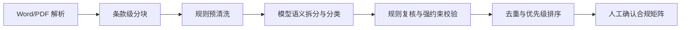

# 投标 Agent MVP-v1.1 需求规划

> 更新时间：2026-05-20  
> 阶段定位：在 MVP1.0 可试用闭环之上，引入受控 AI 能力，重点增强“读、找、拆、分、排、解释”，不进入自动决策、自动提交或完整技术标生成。

## 1. 版本目标

MVP1.1 的核心目标不是让 AI 自由聊天，而是让 AI 在干净、可追溯的投标上下文中辅助处理复杂信息。

重点解决 MVP1.0 暴露出的三类问题：

1. 招标公告/招标文件中长条款未拆到最细粒度。
2. 仅靠关键词规则时，条款分类容易受标题、行业词或上下文污染。
3. 用户需要知道“为什么系统这么分、为什么这么推荐、风险在哪里”。

MVP1.1 应坚持：

- 解析器先提供干净分块。
- 模型只做语义增强，不绕开来源。
- 规则引擎做强约束复核和兜底。
- 高风险、强制项和最终判断仍由人工确认。

## 2. 合规矩阵抽取增强

### 2.1 MVP1.0 规则兜底

MVP1.0 已先用确定性规则修复以下问题：

1. Word 解析不再把长编号条款误判为章节标题。
2. 公告大标题、项目编号、预算金额、联系方式等非合规要求不进入矩阵。
3. 长资格条款按 `2.1`、`（1）`、`（2）`、资质枚举等拆成原子要求。
4. 截止时间、下载招标文件等高频重复项使用语义 key 去重。
5. “电子与智能化工程专业承包资质”按资格要求处理，不因“电子”误归为格式要求。
6. 强制重新生成矩阵时，同一解析版本的旧候选项被标记为 `superseded`，避免新旧候选混在同一矩阵中。

这些规则作为 MVP1.1 的兜底层继续保留。

### 2.2 MVP1.1 模型增强方案

MVP1.1 在规则兜底之上增加模型抽取层。

处理流程：

模型负责：

1. 判断一段文本是否包含多个独立要求。
2. 将长条款拆成最小可处理单元。
3. 对每个单元分类为资格要求、强制响应、截止时间、格式要求、评分项、技术响应或参考信息。
4. 输出分类理由、风险初判和待人工确认点。
5. 标记低置信度或冲突项。

规则复核负责：

1. 截止时间、开标时间、下载文件、CA、格式要求等硬字段优先按规则校验。
2. 资质、许可证、人员证书、信用查询、联合体等资格项优先按规则保护。
3. 联系方式、采购人、代理机构、公告标题等非合规信息不得进入矩阵。
4. 模型输出必须引用 `source_chunk_id` 和原文摘录。
5. 模型不得生成原文不存在的要求。

## 3. 输出结构要求

模型输出必须是结构化 JSON，至少包含：

| 字段 | 说明 |
| --- | --- |
| `source_chunk_index` | 来源解析分块序号 |
| `requirement_text` | 原文或忠实摘录后的最小要求 |
| `item_type` | 合规项类型 |
| `normalized_requirement` | 归一化描述或语义 key |
| `risk_level` | 低/中/高风险初判 |
| `is_mandatory` | 是否强制处理 |
| `classification_reason` | 分类理由 |
| `split_reason` | 为什么拆成该条 |
| `needs_human_review` | 是否需要人工复核 |
| `confidence_score` | 置信度 |

落库前必须经过规则复核；复核失败的项不直接进入正式矩阵，可进入“待人工复核候选”。

## 4. 风险控制

MVP1.1 不允许模型：

1. 自动确认高风险项。
2. 自动绑定证据。
3. 自动覆盖人工修改过的矩阵项。
4. 自动审批、自动导出正式文件、自动提交。
5. 编造招标文件中不存在的资格、日期、金额或技术参数。

当模型和规则冲突时：

- 截止时间、金额、资质、证书、联合体、否决项以规则和人工确认为准。
- 低置信度项进入人工确认队列。
- 高风险项即使模型判断“可通过”，也必须人工确认。

## 5. 验收标准

MVP1.1 合规矩阵增强的验收标准：

1. 同一长资格条款能拆成独立资质、许可证、人员证书、信用要求等原子项。
2. 公告标题、项目编号、采购人联系方式等不进入合规矩阵。
3. 同一截止时间在多个位置出现时，不重复生成多个矩阵项。
4. 行业词不会污染全局分类，例如项目名包含“净化”不导致所有条款变成技术响应。
5. 模型输出的每个矩阵项都有来源 chunk 和原文。
6. 模型分类理由和规则复核结果可在前端展示。
7. 强制重新生成后旧候选项不与新候选项混排。
8. 人工修改过的矩阵项不会被静默覆盖。

## 6. 不进入 MVP1.1 的内容

以下能力继续顺延：

1. 完整技术标核心章节生成。
2. 净化设备产品选型承诺。
3. 投标示意图或正式设计图。
4. 多 Agent 编排。
5. 报价测算。
6. 自动报名、自动签章、自动提交。

