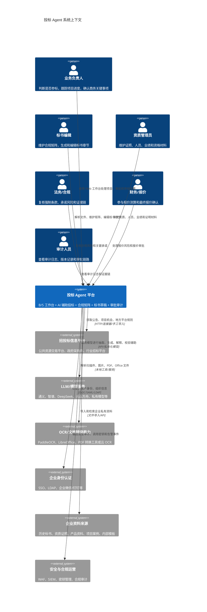
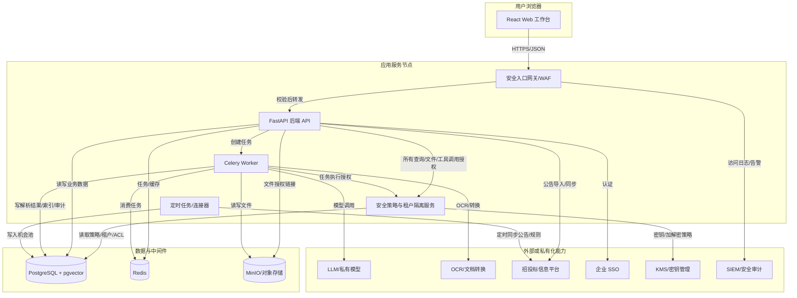

# 投标 Agent 项目 C4 架构图

> 版本：v0.1  
> 日期：2026-05-14  
> 关联文档：《投标Agent项目架构草案》《投标Agent需求清单》《投标Agent技术选型文档》

## 1. C4-Context：系统上下文图

## 2. C4-Container：容器图

```mermaid
C4Container
    title 投标 Agent 容器图

    Person(user, "业务用户", "业务、标书、资质、法务、财务、审计等角色")

    System_Boundary(agent, "投标 Agent 平台") {
        Container(edge, "安全入口网关", "API Gateway/WAF", "TLS 终止、租户识别、访问控制、限流、防护、请求审计")
        Container(web, "Web 工作台", "React + TypeScript + Ant Design", "系统首页、项目工作台、合规矩阵、章节编辑、审批任务、右侧智能助手")
        Container(api, "后端 API", "Python + FastAPI", "认证鉴权、项目接口、文件接口、矩阵接口、审批接口、审计查询")
        Container(policy, "安全策略与租户隔离服务", "Policy Engine", "RBAC/ABAC、项目 ACL、数据等级、查询范围裁剪、工具调用授权")
        Container(harness, "Agent Harness", "Python", "任务编排、上下文管理、Prompt 构建、工具调度、状态机")
        Container(worker, "异步 Worker", "Celery/RQ + Python", "文档解析、OCR、索引构建、章节生成、导出文件、批处理")
        Container(rule, "规则引擎", "Python + JSON/YAML 规则", "地方规则包、企业规则、强制项、资格有效期、格式校验")
        Container(rag, "RAG/检索服务", "PostgreSQL FTS + pgvector", "关键词检索、向量检索、元数据过滤、证据片段召回")
        Container(llm_gateway, "LLM Provider 抽象层", "Python Adapter", "多模型路由、脱敏、调用审计、重试、版本冻结")

        ContainerDb(db, "PostgreSQL + pgvector", "关系数据库/向量扩展", "项目、标段、文档、矩阵、审批、审计、向量索引")
        ContainerDb(redis, "Redis", "缓存/队列", "任务队列、缓存、限流、短期状态")
        ContainerDb(obj, "对象存储", "MinIO/OSS/COS", "原始文件、解析产物、导出文件、版本快照")
    }

    System_Ext(models, "外部/私有 LLM", "通义、智谱、DeepSeek、火山方舟、私有模型")
    System_Ext(platforms, "招投标平台", "公告、采购意向、地方规则、澄清公告")
    System_Ext(ocr, "OCR/转换工具", "PaddleOCR、LibreOffice、Poppler 或云 OCR")
    System_Ext(sso, "企业 SSO", "统一身份认证")
    System_Ext(kms, "KMS/密钥管理", "模型密钥、对象存储密钥、租户密钥")
    System_Ext(siem, "SIEM/安全审计平台", "安全日志、告警、合规审计")

    Rel(user, edge, "访问", "HTTPS/浏览器")
    Rel(edge, web, "转发静态资源/页面访问")
    Rel(web, edge, "调用业务接口", "HTTPS/JSON")
    Rel(edge, api, "校验后转发请求")
    Rel(api, sso, "认证/同步用户", "OIDC/SAML/LDAP")
    Rel(api, policy, "所有查询、文件访问和工具调用前进行授权")
    Rel(api, db, "读写结构化数据")
    Rel(api, obj, "生成授权上传/下载链接")
    Rel(api, redis, "读写短期状态、提交异步任务")
    Rel(api, harness, "创建 Agent 任务")
    Rel(policy, db, "读取租户、角色、ACL、数据等级策略")
    Rel(policy, kms, "获取授权密钥/加解密策略")

    Rel(harness, policy, "工具调用、检索上下文和模型上下文授权")
    Rel(harness, rule, "规则校验")
    Rel(harness, rag, "检索证据")
    Rel(harness, llm_gateway, "调用模型能力")
    Rel(harness, db, "保存任务状态、输出和审计")

    Rel(worker, redis, "消费任务")
    Rel(worker, obj, "读取原文/写入产物")
    Rel(worker, db, "写入解析结果、索引和任务状态")
    Rel(worker, ocr, "文档解析/OCR/转换")
    Rel(worker, harness, "执行长任务编排")
    Rel(worker, policy, "执行任务前校验租户和数据范围")

    Rel(rule, db, "读取规则版本、写入命中结果")
    Rel(rag, policy, "检索前执行租户隔离、项目 ACL 和数据等级过滤")
    Rel(rag, db, "全文检索和向量检索")
    Rel(llm_gateway, models, "模型调用", "API/内网")
    Rel(llm_gateway, policy, "模型上下文脱敏和外发授权检查")
    Rel(edge, siem, "输出访问日志、安全告警")
    Rel(api, siem, "输出业务安全审计")
    Rel(api, platforms, "手工导入或连接器同步", "HTTP/API")
```

## 3. C4-Component：后端核心组件图

```mermaid
C4Component
    title 后端 API 与 Agent Harness 组件图

    Container_Boundary(backend, "后端服务") {
        Component(auth, "认证组件", "FastAPI Middleware/Service", "SSO 集成、身份解析、会话校验")
        Component(policy_engine, "安全策略组件", "Policy Engine", "RBAC/ABAC、租户隔离、项目 ACL、数据等级、查询范围裁剪")
        Component(security_audit, "安全审计组件", "Audit Service", "访问审计、越权拦截、敏感数据访问、异常行为记录")
        Component(project, "项目与标段服务", "Service", "项目、标段、状态、成员、进度统计")
        Component(opportunity, "机会与参标预评估服务", "Service", "公告抽取、企业画像匹配、Go/No-Go 建议")
        Component(document, "文件与解析服务", "Service", "上传、预览、解析任务、解析版本、人工修正")
        Component(matrix, "合规矩阵服务", "Service", "矩阵生成、筛选、排序、批量操作、证据回链")
        Component(rule_component, "规则包服务", "Rule Engine", "地方规则包、企业规则、版本冻结、规则热加载")
        Component(kb, "知识库与检索服务", "RAG Service", "资料导入、混合检索、权限过滤、证据片段")
        Component(draft, "标书章节服务", "Service", "章节大纲、草稿生成、事实性校验、版本快照")
        Component(workflow, "审批流服务", "State Machine", "审批任务、人工关口、复核预留、状态流转")
        Component(audit, "审计与证据链服务", "Service", "操作日志、模型调用、工具调用、差异记录、证据卡片")
        Component(task, "异步任务调度", "Celery Client", "解析、OCR、索引、生成、导出等长任务")
        Component(llm, "LLM 网关", "Adapter", "模型路由、脱敏、重试、Token 统计、调用审计")
        Component(storage, "文件存储适配器", "Adapter", "对象存储读写、短期链接、版本快照")
    }

    ContainerDb(db, "PostgreSQL + pgvector", "项目数据、规则、审计、向量")
    ContainerDb(redis, "Redis", "任务队列、缓存、限流")
    ContainerDb(obj, "对象存储", "原始文件、解析产物、导出文件")
    System_Ext(model, "LLM 服务", "模型 API 或私有模型")
    System_Ext(ocr, "OCR/转换工具", "PaddleOCR、LibreOffice、Poppler")
    System_Ext(kms, "KMS/密钥管理", "租户密钥、模型密钥、对象存储密钥")

    Rel(auth, db, "读取用户、角色、权限")
    Rel(auth, policy_engine, "传递用户、租户、角色上下文")
    Rel(policy_engine, db, "读取 ACL、数据等级、租户策略")
    Rel(policy_engine, kms, "获取授权密钥和加解密策略")
    Rel(policy_engine, security_audit, "记录策略命中、拒绝和越权尝试")
    Rel(project, db, "读写项目和标段")
    Rel(opportunity, kb, "匹配企业画像和资料")
    Rel(opportunity, rule_component, "加载地区/行业规则")
    Rel(opportunity, llm, "抽取公告字段、生成参标建议")

    Rel(document, storage, "保存原文和解析产物")
    Rel(document, policy_engine, "文件访问和解析前授权")
    Rel(document, task, "提交解析/OCR 任务")
    Rel(document, matrix, "解析修正后触发矩阵增量更新")

    Rel(matrix, policy_engine, "矩阵查询和修改前执行数据范围裁剪")
    Rel(matrix, rule_component, "强制项和合规校验")
    Rel(matrix, kb, "绑定证据来源")
    Rel(matrix, audit, "记录人工修改、批量操作、修改原因")

    Rel(rule_component, db, "读取规则包和版本")
    Rel(kb, policy_engine, "检索前做租户、项目、数据等级过滤")
    Rel(kb, db, "关键词检索、向量检索、权限过滤")
    Rel(draft, matrix, "读取合规矩阵")
    Rel(draft, kb, "检索证据")
    Rel(draft, llm, "生成草稿")
    Rel(draft, audit, "记录事实性校验和无法验证项")

    Rel(workflow, db, "读写审批任务和状态")
    Rel(workflow, audit, "记录审批动作")
    Rel(task, redis, "投递/消费任务")
    Rel(task, policy_engine, "任务执行前校验租户和数据范围")
    Rel(task, ocr, "执行 OCR/转换")
    Rel(llm, model, "调用模型")
    Rel(llm, policy_engine, "模型上下文脱敏、外发授权和供应商限制")
    Rel(storage, obj, "读写文件")
    Rel(storage, policy_engine, "生成短期链接前校验权限")
    Rel(security_audit, audit, "写入安全审计事件")
    Rel(audit, db, "写入审计日志和证据链")
```

## 4. C4-Deployment：本地开发与生产部署视图

## 5. 图中关键边界

- Web 工作台只负责展示、编辑、确认和发起任务，不保存模型密钥、签章密钥或高权限凭据。
- SaaS 模式下所有用户请求、查询、文件访问、RAG 检索、模型上下文构建和 Agent 工具调用都必须先经过安全入口网关和安全策略组件。
- 安全策略组件必须执行租户隔离、RBAC/ABAC、项目 ACL、数据等级过滤、查询范围裁剪、敏感字段脱敏和审计记录。
- 后端 API 是所有文件、权限、Agent 任务和审计动作的统一入口。
- 长耗时任务通过 Worker 异步处理，避免 API 阻塞。
- 规则包、模型版本、Prompt 模板版本和解析结果版本都需要按项目冻结。
- LLM 输出不得直接成为最终事实，必须经过证据回链、规则校验、事实性校验和人工确认。
- 报价、最终提交、电子签章和关键商务承诺必须保留人工关口。
