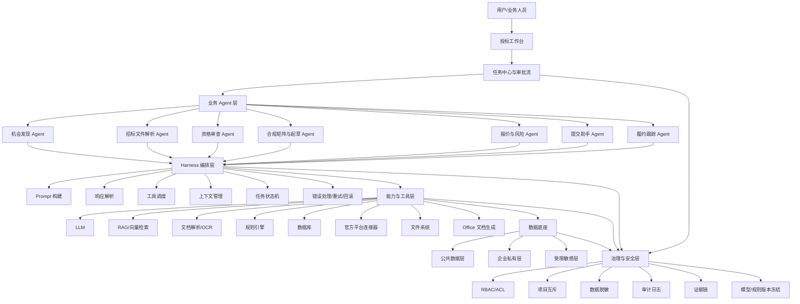
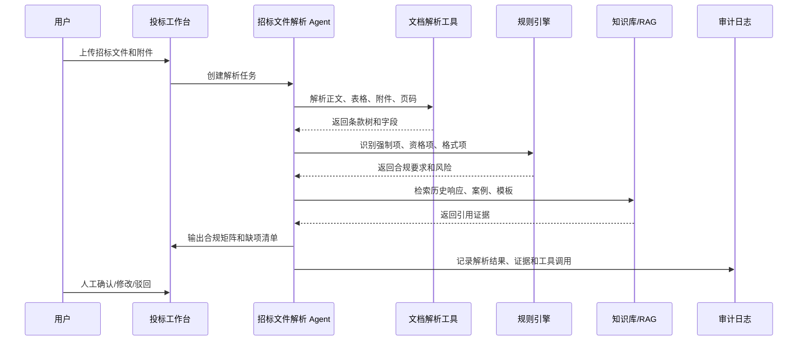
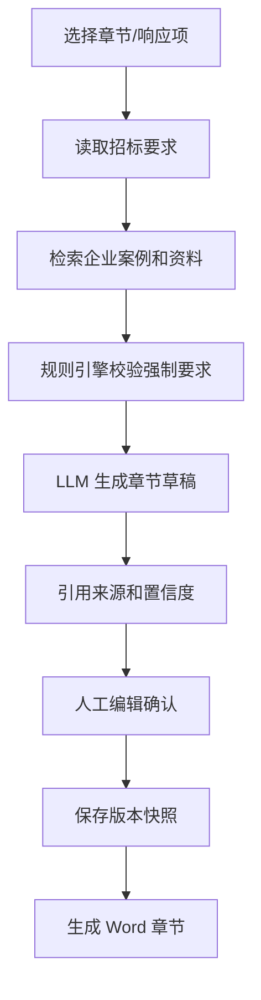

# 投标 Agent 项目架构草案

> 版本：v0.2  
> 日期：2026-05-14  
> 依据：《在中国环境下利用AI开展投标工作的专业Agent可行性评估报告》

## 1. 项目定位

本项目拟建设一个面向中国招投标业务场景的专业投标 Agent。系统定位不是“无人值守自动投标”，而是“强辅助、有限执行、人机协同、全程留痕”的投标工作平台。

Agent 可以承担信息获取、招标文件解析、资格材料归集、合规矩阵生成、历史案例检索、标书初稿生成、风险提示、提交前检查等工作；但以下动作必须保留人工确认：

- 是否参标决策
- 资格真实性确认
- 联合体、关联方、客户冲突判断
- 最终报价和关键商务承诺
- 电子签章、CA/UKey 控制
- 最终提交

项目建设原则：

- 证据优先：所有关键结论必须能回链到原文、原始文件或规则来源。
- 规则先行：强制条款、资格要求、合规红线优先用规则引擎校验。
- 人工关口：关键法律和商务动作必须由授权人员确认。
- 项目隔离：按客户、项目、标段隔离上下文、知识库、日志和文件。
- 全程审计：记录输入、模型输出、检索证据、工具调用、人工修改和审批动作。

## 2. 总体架构

项目采用“业务 Agent + Harness 编排 + 工具能力 + 数据治理 + 人工审批”的分层架构。

交互形态建议采用 B/S 架构，即以浏览器访问的投标 Web 工作台作为主要用户界面，后端集中承载文档解析、Agent 编排、权限控制、审计日志、文件生成和数据存储能力。相较 C/S 客户端，B/S 更适合本项目的安全治理和协同要求：敏感文件不落到个人终端应用，权限、规则、模型版本和审计策略可集中控制，业务、法务、资质、财务等角色也更容易在同一项目空间内协作。



## 3. 分层说明

### 3.1 投标工作台

投标工作台是用户入口，面向业务、法务、资质、财务、项目经理和授权提交人员。

建议实现为私有化部署或内网访问的 Web 工作台，作为项目的可视化交互页面。浏览器端只负责展示、编辑、确认和发起任务，所有敏感数据处理、Agent 执行、权限判定、文件生成和审计记录均在服务端完成。前端不应长期缓存受限敏感材料，也不应保存模型密钥、平台账号、签章密钥或其他高权限凭据。

核心能力：

- 项目机会列表
- 招标文件上传与解析结果查看
- 合规矩阵查看与人工确认
- 标书章节草稿编辑
- 资格材料清单与缺项提醒
- 风险清单与整改建议
- 审批任务与操作留痕
- 提交前检查清单

### 3.2 业务 Agent 层

业务 Agent 不直接代表企业作出最终法律行为，只负责在受控范围内完成分析、生成、校验和提醒。

| Agent | 主要职责 | MVP 是否包含 |
| --- | --- | --- |
| 机会发现 Agent | 抓取公告、去重、匹配企业画像、生成 Go/No-Go 建议 | 可选 |
| 招标文件解析 Agent | 解析招标文件、附件、澄清文件，抽取条款和关键字段 | 必须 |
| 资格审查 Agent | 抽取资格要求，匹配企业证照、人员、业绩、财务材料 | 必须 |
| 合规矩阵与起草 Agent | 生成强制响应矩阵、章节大纲、标书初稿和证据引用 | 必须 |
| 报价与风险 Agent | 做成本测算辅助、异常低价预警、履约风险提示 | 第二阶段 |
| 提交助手 Agent | 提交前完整性检查、截止时间提醒、回执归档 | 第二阶段 |
| 履约跟踪 Agent | 中标后抽取合同义务、里程碑、验收和违约风险 | 第二阶段 |

### 3.3 Harness 编排层

Harness 是 Agent 的执行内核，负责把用户任务拆成可执行步骤，并控制 LLM、工具、上下文和状态流转。

核心职责：

- Prompt 构建：根据任务类型、角色权限、项目上下文、检索证据生成提示词。
- 响应解析：将模型输出解析为结构化 JSON、表格、章节草稿或工具调用指令。
- 工具调度：调用文档解析、检索、规则校验、数据库、文件生成等工具。
- 上下文管理：按项目、标段、文档、用户角色维护上下文窗口。
- 状态机：管理“待解析、待确认、待整改、已确认、已归档”等任务状态。
- 错误处理：对解析失败、工具超时、模型输出不合规等情况进行重试或降级。

建议在早期避免过度复杂的多 Agent 自主协作，优先采用“工作流 + 单任务 Agent + 人工确认”的方式。

### 3.4 能力与工具层

| 能力 | 说明 | 建议 |
| --- | --- | --- |
| LLM | 负责理解、归纳、起草、解释和问答 | 支持多模型切换，按项目冻结模型版本 |
| 文档解析 | 解析 PDF、Word、Excel、扫描件、图片附件 | MVP 核心能力，优先保障准确率 |
| RAG 检索 | 从法规、历史标书、案例、产品资料中找证据 | 输出必须带来源引用 |
| 规则引擎 | 校验强制响应项、资质有效期、格式要求、合规红线 | 高风险判断不得只靠 LLM |
| 数据库 | 存储项目、文档、任务、日志、审批和元数据 | 结构化数据优先入库 |
| 文件系统 | 管理原始文件、解析中间件、生成文档、版本快照 | 文件需绑定项目和权限 |
| 官方平台连接器 | 接入公共资源交易平台、政府采购网等 | 可从手工导入起步 |
| Office 生成 | 生成 Word 标书章节、Excel 合规矩阵、PDF 预览 | MVP 建议先支持 Word/Excel |

## 4. 数据架构

数据底座分为三层，避免把不同风险等级的数据混入同一索引或同一上下文。

### 4.1 公共数据层

数据范围：

- 招标公告
- 中标公示
- 政策法规
- 地方平台规则
- 标准招标文件模板
- 公开合同或公开案例

用途：

- 机会发现
- 政策检索
- 地方规则匹配
- 项目背景分析

### 4.2 企业私有层

数据范围：

- 企业历史标书
- 项目案例
- 产品资料
- 技术方案
- 资质证照
- 常见问答
- 内部模板

用途：

- 标书内容复用
- 方案起草
- 资格匹配
- 案例检索

### 4.3 受限敏感层

数据范围：

- 身份证件
- 人员简历
- 社保材料
- 财务报表
- 银行信息
- 报价成本
- 客户敏感信息

控制要求：

- 默认不进入通用向量库。
- 进入模型上下文前应脱敏、分权或令牌化。
- 权限按项目和角色控制。
- 所有访问和引用必须审计。
- 不应直接发送到不满足合规要求的外部模型 API。

## 5. 核心业务流程

### 5.1 招标文件解析到合规矩阵



### 5.2 标书章节起草



生成原则：

- 不能无依据生成资格、业绩、人员、财务、证照信息。
- 草稿必须标注引用来源。
- 涉及承诺、报价、交付周期、售后范围的内容必须进入人工审批。
- 高风险章节应默认要求人工复核。

### 5.3 四道人工关口

| 关口 | 审批人 | Agent 可做 | Agent 不可做 |
| --- | --- | --- | --- |
| 是否参标 | 业务负责人 | 提供机会评分、风险提示、项目摘要 | 自动决定参标 |
| 资格真实性 | 法务/资质管理员 | 生成资格清单、缺项提醒、证据回链 | 自动编造或确认资质 |
| 报价与关键承诺 | 财务/业务负责人 | 测算、对比、风险预警 | 自动确定最终报价 |
| 提交关口 | 授权提交人 | 完整性检查、倒计时、回执归档 | 持有签章密钥或代为最终签章 |

## 6. MVP 范围

第一阶段目标是做出可演示、可验证价值的最小闭环，而不是一次性完成完整平台。

### 6.1 MVP 必做

- 项目管理：创建项目、上传招标文件、管理附件。
- 文档解析：解析 PDF/Word/Excel，抽取章节、条款、表格和关键字段。
- 要素抽取：抽取项目名称、采购人、预算、截止时间、资格要求、评分办法、强制响应项。
- 合规矩阵：生成“要求、响应建议、证据来源、责任人、状态”的矩阵。
- 私有知识库：导入企业资料、历史案例、产品文档，支持引用式检索。
- 章节起草：基于招标要求和企业资料生成标书章节草稿。
- 人工确认：支持人工修改、确认、驳回。
- 审计日志：记录上传、解析、检索、生成、修改和确认动作。
- Word/Excel 导出：导出章节草稿和合规矩阵。

### 6.2 MVP 暂不做或弱化

- 自动登录各地公共资源交易平台。
- 自动提交投标文件。
- 自动电子签章。
- 复杂报价优化。
- 多客户同标并发服务。
- 大规模多 Agent 自主协作。
- 全量 MLOps 平台。

## 7. 建议技术选型

### 7.1 后端

建议：

- Python + FastAPI：适合 AI 编排、文档解析、异步任务和工具集成。
- PostgreSQL：存储项目、任务、权限、日志和结构化抽取结果。
- Redis：任务队列、缓存、短期状态。
- Celery/RQ/Arq：处理文档解析、索引构建、批量生成等异步任务。

### 7.2 AI 与检索

建议：

- LLM Provider 抽象层：支持 OpenAI、Claude、通义、智谱、DeepSeek、火山方舟等模型切换。
- 向量库：可从 pgvector 起步，后续再评估 Milvus、Qdrant、Elasticsearch 混合检索。
- RAG：采用“关键词检索 + 向量检索 + 元数据过滤 + 引用片段”的组合。
- 规则引擎：早期可用 Python 规则模块 + YAML/JSON 规则配置，后续再演进为独立规则服务。

### 7.3 文档处理

建议：

- PDF 文本解析：PyMuPDF、pdfplumber。
- OCR：PaddleOCR 或云 OCR。
- Word：python-docx。
- Excel：openpyxl。
- 文档切分：按标题、页码、表格、附件、条款编号切分。

### 7.4 前端与交互形态

建议：

- 采用 B/S 架构建设可视化投标 Web 工作台，优先支持私有化部署、内网访问、统一登录和集中权限控制。
- React/Next.js 或 Vue/Nuxt。
- 核心界面包括项目列表、文件解析视图、合规矩阵、章节编辑器、知识库、审批任务、审计日志。
- MVP 可先做内部 Web 工作台，不急于做复杂门户。
- 浏览器端避免持久化保存敏感原文、报价、个人证件、社保材料等受限数据；如确需临时缓存，应设置短有效期、加密和退出清理策略。
- 所有导出、预览、下载、审批和修改动作应回传后端统一记录审计日志。

## 8. 权限与安全

权限模型建议采用“租户/组织 + 项目 + 角色 + 数据等级”的组合。

基础角色：

- 管理员
- 业务负责人
- 标书编辑
- 资质管理员
- 法务/合规
- 财务/报价
- 授权提交人
- 审计人员

关键控制：

- B/S 入口统一认证和会话管理，禁止绕过后端权限直接访问文件、索引或生成结果。
- 项目级 ACL：用户只能访问授权项目。
- 数据分级：公共、内部、受限、机密。
- 报价和敏感个人信息单独授权。
- 关键动作双人复核。
- 模型输出不能绕过审批流直接进入最终提交文件。
- 审计日志不可由普通用户删除。

## 9. 审计与证据链

每次 Agent 输出都应记录：

- 用户输入
- 项目 ID、标段 ID、文档 ID
- 使用的模型和版本
- Prompt 模板版本
- 检索到的证据片段
- 工具调用记录
- 规则校验结果
- 生成内容
- 人工修改差异
- 审批动作
- 导出文件版本

关键输出建议具备“证据卡片”：

| 字段 | 说明 |
| --- | --- |
| 结论 | Agent 给出的判断或生成内容 |
| 来源 | 招标文件页码、企业资料、规则条款或历史案例 |
| 置信度 | 高/中/低 |
| 风险等级 | 无/低/中/高 |
| 需要人工确认 | 是/否 |
| 责任人 | 当前确认角色 |

## 10. 项目目录建议

后续代码工程可按以下结构组织：

```text
pxss_bid_agent/
  docs/
    architecture.md
    product_requirements.md
    data_schema.md
    compliance_rules.md
  backend/
    app/
      api/
      agents/
      harness/
      tools/
      rules/
      retrieval/
      parsers/
      services/
      models/
      audit/
    tests/
  frontend/
    src/
      pages/
      components/
      features/
      api/
  data/
    samples/
    rules/
    templates/
  scripts/
  docker-compose.yml
  README.md
```

## 11. 阶段路线

### 阶段一：MVP，8-12 周

目标：

- 完成招标文件上传、解析、合规矩阵、知识库检索、章节起草、人工确认、基础审计。

验收指标：

- 能解析常见 PDF/Word 招标文件。
- 能抽取主要资格要求和强制响应项。
- 能生成合规矩阵并导出 Excel。
- 能基于企业资料生成带引用的章节草稿。
- 关键动作有审计日志。

### 阶段二：扩展，3-6 个月

目标：

- 增加报价风险、提交助手、审批流、更多官方信息源连接器、规则版本管理。

重点：

- 报价只做辅助，不做最终决策。
- 提交助手只做检查和提醒，不持有签章密钥。
- 地方规则包按省市和行业维护。

### 阶段三：生产化，6-12 个月

目标：

- 完成单租户/私有化部署、SSO、RBAC、项目互斥、审计报表、模型版本冻结、容灾和运维监控。

重点：

- 项目级隔离。
- 多租户同标冲突阻断。
- 受限数据脱敏和访问审计。
- 高峰期变更冻结和回滚机制。

## 12. 当前建议的第一步

建议先从“招标文件解析 + 合规矩阵 + 私有知识库检索 + 章节草稿生成”做原型。

第一批可准备的样例数据：

- 3-5 份真实或脱敏后的招标文件。
- 5-10 份历史标书。
- 企业资质证照样例。
- 产品/服务介绍资料。
- 常用技术方案模板。
- 一份人工整理的合规矩阵样例。

第一批工程任务：

- 建立项目目录和 README。
- 设计项目、文档、条款、合规矩阵、审计日志的数据表。
- 实现文件上传和文档解析接口。
- 实现规则项抽取 Prompt 和解析器。
- 实现基础 RAG 检索。
- 实现合规矩阵生成。
- 实现章节草稿生成和 Word/Excel 导出。
